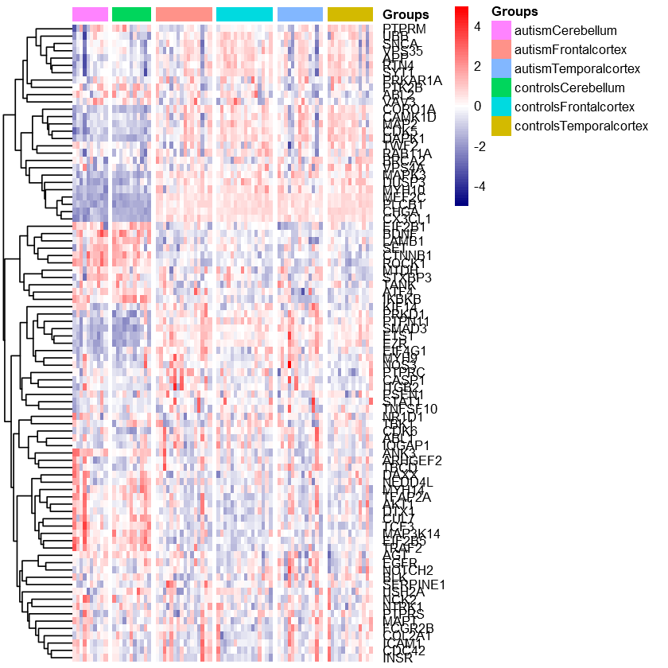

```R
#https://www.ncbi.nlm.nih.gov/geo/query/acc.cgi?acc=GSE28521
```


```R
setwd(R"(D:\OneDrive - St John's National Academy of Health Sciences\Working\GSE28521)")
```


```R
# BiocManager::install("illuminaHumanv3.db")
```


```R
rm(list=ls())
options(warn=-1)
sw=suppressPackageStartupMessages
sw(library(limma))
sw(library(pheatmap))
sw(library(EnhancedVolcano))
sw(library(dplyr))
sw(library(tidyverse))
sw(library(illuminaHumanv3.db))
sw(library(RColorBrewer))
```


```R
#to see the files in the directory
list.files()
```


<style>
.list-inline {list-style: none; margin:0; padding: 0}
.list-inline>li {display: inline-block}
.list-inline>li:not(:last-child)::after {content: "\00b7"; padding: 0 .5ex}
</style>
<ol class=list-inline><li>'GSE28521_non-normalized_data.txt'</li><li>'GSE28521_non-normalized_data.txt.gz'</li><li>'GSE28521_series_matrix.txt'</li><li>'GSE28521_series_matrix.txt.gz'</li><li>'target.txt'</li></ol>


```R
df = read.table('GSE28521_non-normalized_data.txt', sep='\t', row.names = 1, header = 1)
dim(df)
head(df,4)
```


<style>
.list-inline {list-style: none; margin:0; padding: 0}
.list-inline>li {display: inline-block}
.list-inline>li:not(:last-child)::after {content: "\00b7"; padding: 0 .5ex}
</style>
<ol class=list-inline><li>24526</li><li>316</li></ol>


<table class="dataframe">
<caption>A data.frame: 4 × 316</caption>
<thead>
	<tr><th></th><th scope=col>X4936551012_A.AVG_Signal</th><th scope=col>X4936551012_A.Detection.Pval</th><th scope=col>X4936551012_A.BEAD_STDERR</th><th scope=col>X4936551012_A.Avg_NBEADS</th><th scope=col>X4936551012_B.AVG_Signal</th><th scope=col>X4936551012_B.Detection.Pval</th><th scope=col>X4936551012_B.BEAD_STDERR</th><th scope=col>X4936551012_B.Avg_NBEADS</th><th scope=col>X4936551012_C.AVG_Signal</th><th scope=col>X4936551012_C.Detection.Pval</th><th scope=col>...</th><th scope=col>X4936551014_E.BEAD_STDERR</th><th scope=col>X4936551014_E.Avg_NBEADS</th><th scope=col>X4936551014_F.AVG_Signal</th><th scope=col>X4936551014_F.Detection.Pval</th><th scope=col>X4936551014_F.BEAD_STDERR</th><th scope=col>X4936551014_F.Avg_NBEADS</th><th scope=col>X4936551014_G.AVG_Signal</th><th scope=col>X4936551014_G.Detection.Pval</th><th scope=col>X4936551014_G.BEAD_STDERR</th><th scope=col>X4936551014_G.Avg_NBEADS</th></tr>
	<tr><th></th><th scope=col>&lt;dbl&gt;</th><th scope=col>&lt;dbl&gt;</th><th scope=col>&lt;dbl&gt;</th><th scope=col>&lt;int&gt;</th><th scope=col>&lt;dbl&gt;</th><th scope=col>&lt;dbl&gt;</th><th scope=col>&lt;dbl&gt;</th><th scope=col>&lt;int&gt;</th><th scope=col>&lt;dbl&gt;</th><th scope=col>&lt;dbl&gt;</th><th scope=col>...</th><th scope=col>&lt;dbl&gt;</th><th scope=col>&lt;int&gt;</th><th scope=col>&lt;dbl&gt;</th><th scope=col>&lt;dbl&gt;</th><th scope=col>&lt;dbl&gt;</th><th scope=col>&lt;int&gt;</th><th scope=col>&lt;dbl&gt;</th><th scope=col>&lt;dbl&gt;</th><th scope=col>&lt;dbl&gt;</th><th scope=col>&lt;int&gt;</th></tr>
</thead>
<tbody>
	<tr><th scope=row>ILMN_1809034</th><td>414.7578</td><td>0.028614460</td><td>31.809590</td><td>33</td><td>377.9304</td><td>0.034638550</td><td>24.10069</td><td>31</td><td> 432.4458</td><td>0.069277110</td><td>...</td><td>14.451550</td><td>34</td><td>291.7565</td><td>0.076807230</td><td>15.36769</td><td>34</td><td>190.2195</td><td>0.257530100</td><td>11.145550</td><td>31</td></tr>
	<tr><th scope=row>ILMN_1660305</th><td>803.7913</td><td>0.001506024</td><td>30.436640</td><td>48</td><td>867.6628</td><td>0.001506024</td><td>34.54819</td><td>38</td><td>1050.1470</td><td>0.001506024</td><td>...</td><td>18.852600</td><td>39</td><td>764.2717</td><td>0.001506024</td><td>31.31591</td><td>37</td><td>372.4062</td><td>0.004518072</td><td>15.629310</td><td>50</td></tr>
	<tr><th scope=row>ILMN_1762337</th><td>174.9232</td><td>0.948795200</td><td> 9.964137</td><td>42</td><td>180.4842</td><td>0.873494000</td><td>11.86012</td><td>32</td><td> 237.0820</td><td>0.688253000</td><td>...</td><td> 9.700734</td><td>39</td><td>185.7462</td><td>0.926204800</td><td>10.46380</td><td>38</td><td>159.3573</td><td>0.673192800</td><td> 7.248287</td><td>35</td></tr>
	<tr><th scope=row>ILMN_2055271</th><td>261.6444</td><td>0.204819300</td><td>15.202810</td><td>43</td><td>234.1544</td><td>0.338855400</td><td>15.84335</td><td>30</td><td> 322.6162</td><td>0.215361400</td><td>...</td><td>16.300210</td><td>26</td><td>262.9730</td><td>0.149096400</td><td>12.98018</td><td>46</td><td>199.4386</td><td>0.207831300</td><td> 6.804756</td><td>34</td></tr>
</tbody>
</table>


```R
#drop the column contains detection pval
df_sub = dplyr::select(df, -contains(c(".Detection.Pval", ".BEAD_STDERR", ".Avg_NBEADS"))) #dplyr
dim(df_sub)
head(df_sub,4)
```


<style>
.list-inline {list-style: none; margin:0; padding: 0}
.list-inline>li {display: inline-block}
.list-inline>li:not(:last-child)::after {content: "\00b7"; padding: 0 .5ex}
</style>
<ol class=list-inline><li>24526</li><li>79</li></ol>


<table class="dataframe">
<caption>A data.frame: 4 × 79</caption>
<thead>
	<tr><th></th><th scope=col>X4936551012_A.AVG_Signal</th><th scope=col>X4936551012_B.AVG_Signal</th><th scope=col>X4936551012_C.AVG_Signal</th><th scope=col>X4936551012_D.AVG_Signal</th><th scope=col>X4936551012_F.AVG_Signal</th><th scope=col>X4936551012_G.AVG_Signal</th><th scope=col>X4936551012_H.AVG_Signal</th><th scope=col>X4936551003_A.AVG_Signal</th><th scope=col>X4936551003_B.AVG_Signal</th><th scope=col>X4936551003_C.AVG_Signal</th><th scope=col>...</th><th scope=col>X4936551004_D.AVG_Signal</th><th scope=col>X4936551004_E.AVG_Signal</th><th scope=col>X4936551004_F.AVG_Signal</th><th scope=col>X4936551004_H.AVG_Signal</th><th scope=col>X4936551014_A.AVG_Signal</th><th scope=col>X4936551014_B.AVG_Signal</th><th scope=col>X4936551014_D.AVG_Signal</th><th scope=col>X4936551014_E.AVG_Signal</th><th scope=col>X4936551014_F.AVG_Signal</th><th scope=col>X4936551014_G.AVG_Signal</th></tr>
	<tr><th></th><th scope=col>&lt;dbl&gt;</th><th scope=col>&lt;dbl&gt;</th><th scope=col>&lt;dbl&gt;</th><th scope=col>&lt;dbl&gt;</th><th scope=col>&lt;dbl&gt;</th><th scope=col>&lt;dbl&gt;</th><th scope=col>&lt;dbl&gt;</th><th scope=col>&lt;dbl&gt;</th><th scope=col>&lt;dbl&gt;</th><th scope=col>&lt;dbl&gt;</th><th scope=col>...</th><th scope=col>&lt;dbl&gt;</th><th scope=col>&lt;dbl&gt;</th><th scope=col>&lt;dbl&gt;</th><th scope=col>&lt;dbl&gt;</th><th scope=col>&lt;dbl&gt;</th><th scope=col>&lt;dbl&gt;</th><th scope=col>&lt;dbl&gt;</th><th scope=col>&lt;dbl&gt;</th><th scope=col>&lt;dbl&gt;</th><th scope=col>&lt;dbl&gt;</th></tr>
</thead>
<tbody>
	<tr><th scope=row>ILMN_1809034</th><td>414.7578</td><td>377.9304</td><td> 432.4458</td><td>328.2062</td><td>211.4335</td><td>504.7367</td><td> 524.0807</td><td>305.3707</td><td>447.6398</td><td>249.1215</td><td>...</td><td>368.5029</td><td>314.7686</td><td>257.8645</td><td>380.2177</td><td>250.1713</td><td>283.0050</td><td>348.1183</td><td>259.9554</td><td>291.7565</td><td>190.2195</td></tr>
	<tr><th scope=row>ILMN_1660305</th><td>803.7913</td><td>867.6628</td><td>1050.1470</td><td>962.6448</td><td>608.0305</td><td>976.9475</td><td>1094.2800</td><td>796.2383</td><td>985.1816</td><td>644.1515</td><td>...</td><td>962.3484</td><td>964.5415</td><td>740.2770</td><td>873.6304</td><td>600.9747</td><td>594.4685</td><td>887.8330</td><td>520.7786</td><td>764.2717</td><td>372.4062</td></tr>
	<tr><th scope=row>ILMN_1762337</th><td>174.9232</td><td>180.4842</td><td> 237.0820</td><td>204.5805</td><td>173.2630</td><td>225.1077</td><td> 334.0266</td><td>244.3195</td><td>293.5786</td><td>153.2825</td><td>...</td><td>193.1138</td><td>229.0237</td><td>202.5191</td><td>242.7349</td><td>155.2502</td><td>184.5136</td><td>222.5967</td><td>192.2663</td><td>185.7462</td><td>159.3573</td></tr>
	<tr><th scope=row>ILMN_2055271</th><td>261.6444</td><td>234.1544</td><td> 322.6162</td><td>238.2462</td><td>245.6713</td><td>283.6702</td><td> 524.5552</td><td>294.2386</td><td>260.2955</td><td>222.6579</td><td>...</td><td>298.3220</td><td>329.1103</td><td>236.4259</td><td>290.1116</td><td>176.1732</td><td>249.1937</td><td>290.3793</td><td>261.2595</td><td>262.9730</td><td>199.4386</td></tr>
</tbody>
</table>


```R
#standardize the names by removing the unwanted strings in the sample name
names(df_sub) = gsub(pattern = ".AVG_Signal*", replacement = "", x = names(df_sub))
head(df_sub, 4)
```


<table class="dataframe">
<caption>A data.frame: 4 × 79</caption>
<thead>
	<tr><th></th><th scope=col>X4936551012_A</th><th scope=col>X4936551012_B</th><th scope=col>X4936551012_C</th><th scope=col>X4936551012_D</th><th scope=col>X4936551012_F</th><th scope=col>X4936551012_G</th><th scope=col>X4936551012_H</th><th scope=col>X4936551003_A</th><th scope=col>X4936551003_B</th><th scope=col>X4936551003_C</th><th scope=col>...</th><th scope=col>X4936551004_D</th><th scope=col>X4936551004_E</th><th scope=col>X4936551004_F</th><th scope=col>X4936551004_H</th><th scope=col>X4936551014_A</th><th scope=col>X4936551014_B</th><th scope=col>X4936551014_D</th><th scope=col>X4936551014_E</th><th scope=col>X4936551014_F</th><th scope=col>X4936551014_G</th></tr>
	<tr><th></th><th scope=col>&lt;dbl&gt;</th><th scope=col>&lt;dbl&gt;</th><th scope=col>&lt;dbl&gt;</th><th scope=col>&lt;dbl&gt;</th><th scope=col>&lt;dbl&gt;</th><th scope=col>&lt;dbl&gt;</th><th scope=col>&lt;dbl&gt;</th><th scope=col>&lt;dbl&gt;</th><th scope=col>&lt;dbl&gt;</th><th scope=col>&lt;dbl&gt;</th><th scope=col>...</th><th scope=col>&lt;dbl&gt;</th><th scope=col>&lt;dbl&gt;</th><th scope=col>&lt;dbl&gt;</th><th scope=col>&lt;dbl&gt;</th><th scope=col>&lt;dbl&gt;</th><th scope=col>&lt;dbl&gt;</th><th scope=col>&lt;dbl&gt;</th><th scope=col>&lt;dbl&gt;</th><th scope=col>&lt;dbl&gt;</th><th scope=col>&lt;dbl&gt;</th></tr>
</thead>
<tbody>
	<tr><th scope=row>ILMN_1809034</th><td>414.7578</td><td>377.9304</td><td> 432.4458</td><td>328.2062</td><td>211.4335</td><td>504.7367</td><td> 524.0807</td><td>305.3707</td><td>447.6398</td><td>249.1215</td><td>...</td><td>368.5029</td><td>314.7686</td><td>257.8645</td><td>380.2177</td><td>250.1713</td><td>283.0050</td><td>348.1183</td><td>259.9554</td><td>291.7565</td><td>190.2195</td></tr>
	<tr><th scope=row>ILMN_1660305</th><td>803.7913</td><td>867.6628</td><td>1050.1470</td><td>962.6448</td><td>608.0305</td><td>976.9475</td><td>1094.2800</td><td>796.2383</td><td>985.1816</td><td>644.1515</td><td>...</td><td>962.3484</td><td>964.5415</td><td>740.2770</td><td>873.6304</td><td>600.9747</td><td>594.4685</td><td>887.8330</td><td>520.7786</td><td>764.2717</td><td>372.4062</td></tr>
	<tr><th scope=row>ILMN_1762337</th><td>174.9232</td><td>180.4842</td><td> 237.0820</td><td>204.5805</td><td>173.2630</td><td>225.1077</td><td> 334.0266</td><td>244.3195</td><td>293.5786</td><td>153.2825</td><td>...</td><td>193.1138</td><td>229.0237</td><td>202.5191</td><td>242.7349</td><td>155.2502</td><td>184.5136</td><td>222.5967</td><td>192.2663</td><td>185.7462</td><td>159.3573</td></tr>
	<tr><th scope=row>ILMN_2055271</th><td>261.6444</td><td>234.1544</td><td> 322.6162</td><td>238.2462</td><td>245.6713</td><td>283.6702</td><td> 524.5552</td><td>294.2386</td><td>260.2955</td><td>222.6579</td><td>...</td><td>298.3220</td><td>329.1103</td><td>236.4259</td><td>290.1116</td><td>176.1732</td><td>249.1937</td><td>290.3793</td><td>261.2595</td><td>262.9730</td><td>199.4386</td></tr>
</tbody>
</table>


```R
#read the target file
targets = read.delim(file="target.txt", header=T)
head(targets,3)
str(targets)
```


<table class="dataframe">
<caption>A data.frame: 3 × 8</caption>
<thead>
	<tr><th></th><th scope=col>ID</th><th scope=col>Sample_ID</th><th scope=col>Sample_title</th><th scope=col>geo_accession</th><th scope=col>source</th><th scope=col>DiseaseStatus</th><th scope=col>brain_region</th><th scope=col>Group</th></tr>
	<tr><th></th><th scope=col>&lt;chr&gt;</th><th scope=col>&lt;chr&gt;</th><th scope=col>&lt;chr&gt;</th><th scope=col>&lt;chr&gt;</th><th scope=col>&lt;chr&gt;</th><th scope=col>&lt;chr&gt;</th><th scope=col>&lt;chr&gt;</th><th scope=col>&lt;chr&gt;</th></tr>
</thead>
<tbody>
	<tr><th scope=row>1</th><td>X4936551008_G</td><td>4936551008_G</td><td>A_AN11989_C</td><td>GSM706391</td><td>postmortem brain tissue</td><td>autism</td><td>Cerebellum</td><td>autismCerebellum</td></tr>
	<tr><th scope=row>2</th><td>X4936551006_C</td><td>4936551006_C</td><td>A_AN16115_C</td><td>GSM706392</td><td>postmortem brain tissue</td><td>autism</td><td>Cerebellum</td><td>autismCerebellum</td></tr>
	<tr><th scope=row>3</th><td>X4936551007_C</td><td>4936551007_C</td><td>A_AN16641_C</td><td>GSM706393</td><td>postmortem brain tissue</td><td>autism</td><td>Cerebellum</td><td>autismCerebellum</td></tr>
</tbody>
</table>


    'data.frame':	79 obs. of  8 variables:
     $ ID           : chr  "X4936551008_G" "X4936551006_C" "X4936551007_C" "X4936551013_C" ...
     $ Sample_ID    : chr  "4936551008_G" "4936551006_C" "4936551007_C" "4936551013_C" ...
     $ Sample_title : chr  "A_AN11989_C" "A_AN16115_C" "A_AN16641_C" "A_AN17254_C" ...
     $ geo_accession: chr  "GSM706391" "GSM706392" "GSM706393" "GSM706394" ...
     $ source       : chr  "postmortem brain tissue" "postmortem brain tissue" "postmortem brain tissue" "postmortem brain tissue" ...
     $ DiseaseStatus: chr  "autism" "autism" "autism" "autism" ...
     $ brain_region : chr  "Cerebellum" "Cerebellum" "Cerebellum" "Cerebellum" ...
     $ Group        : chr  "autismCerebellum" "autismCerebellum" "autismCerebellum" "autismCerebellum" ...
    


```R
#make expression data and target and in same order
df_sub = df_sub[, targets$ID]
head(df_sub,4)
dim(df_sub)
```


<table class="dataframe">
<caption>A data.frame: 4 × 79</caption>
<thead>
	<tr><th></th><th scope=col>X4936551008_G</th><th scope=col>X4936551006_C</th><th scope=col>X4936551007_C</th><th scope=col>X4936551013_C</th><th scope=col>X4936551012_G</th><th scope=col>X4936551004_C</th><th scope=col>X4936551003_C</th><th scope=col>X4936551012_C</th><th scope=col>X4936551008_C</th><th scope=col>X4936551005_C</th><th scope=col>...</th><th scope=col>X4936551007_E</th><th scope=col>X4936551005_E</th><th scope=col>X4936551006_E</th><th scope=col>X4936551015_E</th><th scope=col>X4936551004_E</th><th scope=col>X4936551003_E</th><th scope=col>X4936551031_H</th><th scope=col>X4936551010_H</th><th scope=col>X4936551014_E</th><th scope=col>X4936551005_H</th></tr>
	<tr><th></th><th scope=col>&lt;dbl&gt;</th><th scope=col>&lt;dbl&gt;</th><th scope=col>&lt;dbl&gt;</th><th scope=col>&lt;dbl&gt;</th><th scope=col>&lt;dbl&gt;</th><th scope=col>&lt;dbl&gt;</th><th scope=col>&lt;dbl&gt;</th><th scope=col>&lt;dbl&gt;</th><th scope=col>&lt;dbl&gt;</th><th scope=col>&lt;dbl&gt;</th><th scope=col>...</th><th scope=col>&lt;dbl&gt;</th><th scope=col>&lt;dbl&gt;</th><th scope=col>&lt;dbl&gt;</th><th scope=col>&lt;dbl&gt;</th><th scope=col>&lt;dbl&gt;</th><th scope=col>&lt;dbl&gt;</th><th scope=col>&lt;dbl&gt;</th><th scope=col>&lt;dbl&gt;</th><th scope=col>&lt;dbl&gt;</th><th scope=col>&lt;dbl&gt;</th></tr>
</thead>
<tbody>
	<tr><th scope=row>ILMN_1809034</th><td>226.4186</td><td>282.3484</td><td>442.1246</td><td>139.9238</td><td>504.7367</td><td>378.4828</td><td>249.1215</td><td> 432.4458</td><td> 344.6547</td><td>285.6263</td><td>...</td><td>352.3838</td><td>368.6791</td><td>221.5529</td><td>331.7635</td><td>314.7686</td><td>227.2210</td><td>305.0265</td><td>453.9253</td><td>259.9554</td><td> 443.0495</td></tr>
	<tr><th scope=row>ILMN_1660305</th><td>604.3032</td><td>653.2398</td><td>838.5015</td><td>322.2769</td><td>976.9475</td><td>817.1129</td><td>644.1515</td><td>1050.1470</td><td>1064.7010</td><td>687.1699</td><td>...</td><td>657.1886</td><td>763.9479</td><td>602.7491</td><td>647.0446</td><td>964.5415</td><td>664.5323</td><td>626.5153</td><td>816.4254</td><td>520.7786</td><td>1055.5640</td></tr>
	<tr><th scope=row>ILMN_1762337</th><td>176.1907</td><td>196.2111</td><td>244.0614</td><td>153.7692</td><td>225.1077</td><td>220.8986</td><td>153.2825</td><td> 237.0820</td><td> 234.8806</td><td>195.5511</td><td>...</td><td>218.6927</td><td>226.5258</td><td>179.7433</td><td>190.3471</td><td>229.0237</td><td>181.4661</td><td>248.4219</td><td>218.8077</td><td>192.2663</td><td> 294.5832</td></tr>
	<tr><th scope=row>ILMN_2055271</th><td>260.3857</td><td>242.4666</td><td>304.1428</td><td>179.6274</td><td>283.6702</td><td>291.2707</td><td>222.6579</td><td> 322.6162</td><td> 283.8613</td><td>252.0460</td><td>...</td><td>258.7113</td><td>277.6072</td><td>188.8087</td><td>241.4442</td><td>329.1103</td><td>209.7577</td><td>353.2606</td><td>361.9207</td><td>261.2595</td><td> 344.9312</td></tr>
</tbody>
</table>


<style>
.list-inline {list-style: none; margin:0; padding: 0}
.list-inline>li {display: inline-block}
.list-inline>li:not(:last-child)::after {content: "\00b7"; padding: 0 .5ex}
</style>
<ol class=list-inline><li>24526</li><li>79</li></ol>


```R
#Perform Quantile normalization
dfnorm = normalizeBetweenArrays(as.matrix(df_sub), method="quantile")
dim(dfnorm)
head(dfnorm)
```


<style>
.list-inline {list-style: none; margin:0; padding: 0}
.list-inline>li {display: inline-block}
.list-inline>li:not(:last-child)::after {content: "\00b7"; padding: 0 .5ex}
</style>
<ol class=list-inline><li>24526</li><li>79</li></ol>


<table class="dataframe">
<caption>A matrix: 6 × 79 of type dbl</caption>
<thead>
	<tr><th></th><th scope=col>X4936551008_G</th><th scope=col>X4936551006_C</th><th scope=col>X4936551007_C</th><th scope=col>X4936551013_C</th><th scope=col>X4936551012_G</th><th scope=col>X4936551004_C</th><th scope=col>X4936551003_C</th><th scope=col>X4936551012_C</th><th scope=col>X4936551008_C</th><th scope=col>X4936551005_C</th><th scope=col>...</th><th scope=col>X4936551007_E</th><th scope=col>X4936551005_E</th><th scope=col>X4936551006_E</th><th scope=col>X4936551015_E</th><th scope=col>X4936551004_E</th><th scope=col>X4936551003_E</th><th scope=col>X4936551031_H</th><th scope=col>X4936551010_H</th><th scope=col>X4936551014_E</th><th scope=col>X4936551005_H</th></tr>
</thead>
<tbody>
	<tr><th scope=row>ILMN_1809034</th><td> 266.7130</td><td> 313.2229</td><td> 409.6419</td><td> 222.6506</td><td>440.4014</td><td> 347.6732</td><td> 302.7046</td><td> 354.7299</td><td> 317.5599</td><td> 304.2372</td><td>...</td><td> 376.2562</td><td> 393.6616</td><td> 265.4208</td><td> 402.9922</td><td> 270.7342</td><td> 285.5536</td><td> 288.9537</td><td> 385.7798</td><td> 296.2546</td><td> 333.1778</td></tr>
	<tr><th scope=row>ILMN_1660305</th><td> 779.2039</td><td> 809.2222</td><td> 760.6595</td><td> 573.5512</td><td>848.8340</td><td> 736.1109</td><td> 714.6766</td><td> 898.3225</td><td> 923.7398</td><td> 742.4804</td><td>...</td><td> 700.3886</td><td> 796.9300</td><td> 800.0443</td><td> 772.3314</td><td> 798.3380</td><td> 851.1961</td><td> 642.8264</td><td> 700.3886</td><td> 633.0626</td><td> 809.4184</td></tr>
	<tr><th scope=row>ILMN_1762337</th><td> 202.1086</td><td> 209.2652</td><td> 222.8520</td><td> 244.9350</td><td>213.4291</td><td> 211.2024</td><td> 185.5586</td><td> 215.6493</td><td> 214.6341</td><td> 205.2800</td><td>...</td><td> 228.3473</td><td> 220.8665</td><td> 209.6807</td><td> 222.9271</td><td> 199.8442</td><td> 221.1962</td><td> 234.3467</td><td> 185.9537</td><td> 210.6583</td><td> 229.5177</td></tr>
	<tr><th scope=row>ILMN_2055271</th><td> 311.5749</td><td> 263.9519</td><td> 281.2153</td><td> 290.4944</td><td>258.4683</td><td> 272.8483</td><td> 272.6535</td><td> 275.6460</td><td> 261.4836</td><td> 268.1315</td><td>...</td><td> 273.7451</td><td> 284.2034</td><td> 221.5424</td><td> 288.1295</td><td> 283.1679</td><td> 261.0904</td><td> 338.3614</td><td> 307.4375</td><td> 298.0932</td><td> 263.1667</td></tr>
	<tr><th scope=row>ILMN_1814316</th><td>1358.1754</td><td>1260.8383</td><td>1545.0114</td><td>1469.4487</td><td>920.5965</td><td>1115.0427</td><td>1039.8097</td><td>1187.5923</td><td>1171.0789</td><td>1086.5137</td><td>...</td><td>2533.0084</td><td>3051.5442</td><td>2740.3334</td><td>3382.3363</td><td>2299.4081</td><td>2886.3989</td><td>2580.2104</td><td>2645.1452</td><td>1884.2797</td><td>2305.7441</td></tr>
	<tr><th scope=row>ILMN_2359168</th><td>1304.2760</td><td>1190.3581</td><td>1640.1363</td><td>1532.1107</td><td>842.7699</td><td>1232.3444</td><td>1012.8437</td><td>1231.3247</td><td>1129.5051</td><td> 971.7368</td><td>...</td><td>2406.7645</td><td>2895.8497</td><td>3056.4868</td><td>3355.2789</td><td>2227.4316</td><td>2929.1974</td><td>2689.2121</td><td>2536.6437</td><td>1838.6394</td><td>2104.0190</td></tr>
</tbody>
</table>


```R
#Log conversion
dfnorm <- as.matrix(log2(dfnorm))
head(dfnorm)
```


<table class="dataframe">
<caption>A matrix: 6 × 79 of type dbl</caption>
<thead>
	<tr><th></th><th scope=col>X4936551008_G</th><th scope=col>X4936551006_C</th><th scope=col>X4936551007_C</th><th scope=col>X4936551013_C</th><th scope=col>X4936551012_G</th><th scope=col>X4936551004_C</th><th scope=col>X4936551003_C</th><th scope=col>X4936551012_C</th><th scope=col>X4936551008_C</th><th scope=col>X4936551005_C</th><th scope=col>...</th><th scope=col>X4936551007_E</th><th scope=col>X4936551005_E</th><th scope=col>X4936551006_E</th><th scope=col>X4936551015_E</th><th scope=col>X4936551004_E</th><th scope=col>X4936551003_E</th><th scope=col>X4936551031_H</th><th scope=col>X4936551010_H</th><th scope=col>X4936551014_E</th><th scope=col>X4936551005_H</th></tr>
</thead>
<tbody>
	<tr><th scope=row>ILMN_1809034</th><td> 8.059144</td><td> 8.291046</td><td> 8.678220</td><td> 7.798637</td><td>8.782675</td><td> 8.441588</td><td> 8.241767</td><td> 8.470577</td><td> 8.310885</td><td> 8.249053</td><td>...</td><td> 8.555572</td><td> 8.620812</td><td> 8.052138</td><td> 8.654608</td><td> 8.080733</td><td> 8.157618</td><td> 8.174694</td><td> 8.591634</td><td> 8.210694</td><td> 8.380148</td></tr>
	<tr><th scope=row>ILMN_1660305</th><td> 9.605857</td><td> 9.660392</td><td> 9.571107</td><td> 9.163778</td><td>9.729339</td><td> 9.523779</td><td> 9.481147</td><td> 9.811090</td><td> 9.851343</td><td> 9.536209</td><td>...</td><td> 9.452012</td><td> 9.638309</td><td> 9.643936</td><td> 9.593076</td><td> 9.640856</td><td> 9.733348</td><td> 9.328285</td><td> 9.452012</td><td> 9.306204</td><td> 9.660742</td></tr>
	<tr><th scope=row>ILMN_1762337</th><td> 7.658987</td><td> 7.709188</td><td> 7.799942</td><td> 7.936255</td><td>7.737613</td><td> 7.722483</td><td> 7.535731</td><td> 7.752544</td><td> 7.745736</td><td> 7.681449</td><td>...</td><td> 7.835086</td><td> 7.787031</td><td> 7.712050</td><td> 7.800428</td><td> 7.642732</td><td> 7.789183</td><td> 7.872501</td><td> 7.538800</td><td> 7.718761</td><td> 7.842462</td></tr>
	<tr><th scope=row>ILMN_2055271</th><td> 8.283435</td><td> 8.044131</td><td> 8.135531</td><td> 8.182366</td><td>8.013843</td><td> 8.091955</td><td> 8.090925</td><td> 8.106673</td><td> 8.030577</td><td> 8.066797</td><td>...</td><td> 8.096690</td><td> 8.150780</td><td> 7.791439</td><td> 8.170574</td><td> 8.145514</td><td> 8.028406</td><td> 8.402421</td><td> 8.264149</td><td> 8.219619</td><td> 8.039833</td></tr>
	<tr><th scope=row>ILMN_1814316</th><td>10.407454</td><td>10.300168</td><td>10.593402</td><td>10.521059</td><td>9.846425</td><td>10.122883</td><td>10.022104</td><td>10.213824</td><td>10.193623</td><td>10.085491</td><td>...</td><td>11.306636</td><td>11.575324</td><td>11.420136</td><td>11.723804</td><td>11.167047</td><td>11.495055</td><td>11.333273</td><td>11.369131</td><td>10.879797</td><td>11.171017</td></tr>
	<tr><th scope=row>ILMN_2359168</th><td>10.349033</td><td>10.217180</td><td>10.679600</td><td>10.581305</td><td>9.718995</td><td>10.267190</td><td> 9.984196</td><td>10.265996</td><td>10.141475</td><td> 9.924422</td><td>...</td><td>11.232879</td><td>11.499771</td><td>11.577659</td><td>11.712217</td><td>11.121165</td><td>11.516290</td><td>11.392968</td><td>11.308705</td><td>10.844423</td><td>11.038932</td></tr>
</tbody>
</table>


```R
#Convert probe ids to gene id
df = data.frame(Gene = unlist(mget(x = rownames(dfnorm), envir = illuminaHumanv3SYMBOL)))
head(df,4)

#Add gene symbols to normalized expression
norm = cbind(df,dfnorm)

#Save the normalized counts
write.table(norm, "quantile_normalized_log_transformed_data.txt", sep='\t')
```


<table class="dataframe">
<caption>A data.frame: 4 × 1</caption>
<thead>
	<tr><th></th><th scope=col>Gene</th></tr>
	<tr><th></th><th scope=col>&lt;chr&gt;</th></tr>
</thead>
<tbody>
	<tr><th scope=row>ILMN_1809034</th><td>GATC </td></tr>
	<tr><th scope=row>ILMN_1660305</th><td>PDE12</td></tr>
	<tr><th scope=row>ILMN_1762337</th><td>MACC1</td></tr>
	<tr><th scope=row>ILMN_2055271</th><td>NA   </td></tr>
</tbody>
</table>


```R
#create design matrix based on the group
conditions<- paste(targets$Group)
head(conditions)
conditions <- factor(conditions, levels=unique(conditions))
design <- model.matrix(~0+ conditions)
colnames(design) <- levels(conditions)
unique(conditions)
```


<style>
.list-inline {list-style: none; margin:0; padding: 0}
.list-inline>li {display: inline-block}
.list-inline>li:not(:last-child)::after {content: "\00b7"; padding: 0 .5ex}
</style>
<ol class=list-inline><li>'autismCerebellum'</li><li>'autismCerebellum'</li><li>'autismCerebellum'</li><li>'autismCerebellum'</li><li>'autismCerebellum'</li><li>'autismCerebellum'</li></ol>


<style>
.list-inline {list-style: none; margin:0; padding: 0}
.list-inline>li {display: inline-block}
.list-inline>li:not(:last-child)::after {content: "\00b7"; padding: 0 .5ex}
</style>
<ol class=list-inline><li>autismCerebellum</li><li>controlsCerebellum</li><li>autismFrontalcortex</li><li>controlsFrontalcortex</li><li>autismTemporalcortex</li><li>controlsTemporalcortex</li></ol>

<details>
	<summary style=display:list-item;cursor:pointer>
		<strong>Levels</strong>:
	</summary>
	<style>
	.list-inline {list-style: none; margin:0; padding: 0}
	.list-inline>li {display: inline-block}
	.list-inline>li:not(:last-child)::after {content: "\00b7"; padding: 0 .5ex}
	</style>
	<ol class=list-inline><li>'autismCerebellum'</li><li>'controlsCerebellum'</li><li>'autismFrontalcortex'</li><li>'controlsFrontalcortex'</li><li>'autismTemporalcortex'</li><li>'controlsTemporalcortex'</li></ol>
</details>


```R
#fit the design to the expression data
fit = lmFit(dfnorm, design)
#make contrast matrix
contrast.matrix <- makeContrasts(Cerebellum = autismCerebellum - controlsCerebellum,
                                 Frontalcortex = autismFrontalcortex - controlsFrontalcortex,
                                 Temporalcortex = autismTemporalcortex - controlsTemporalcortex,
                                 levels = design)
#Fit contrast matrix
fit.cont = contrasts.fit(fit, contrast.matrix)
#Fit ebayes
fit.cont = eBayes(fit.cont)
```


```R
#Generate DEGs by comparison
res=topTable(fit.cont, coef = "Cerebellum", adjust.method = "BH", number = nrow(dfnorm), sort.by = 'p')
#Convert probe ids to gene id
genes = data.frame(Gene = unlist(mget(x = rownames(res), envir = illuminaHumanv3SYMBOL)))
entrez = data.frame(EntrezID = unlist(mget(x = rownames(res), envir = (illuminaHumanv3ENTREZID))))
#Concatenate gene symbols to res
res=cbind(genes,entrez,res)
head(res)
#Save the degs
write.table(res, "Cerebellum.txt", sep='\t')
```


<table class="dataframe">
<caption>A data.frame: 6 × 8</caption>
<thead>
	<tr><th></th><th scope=col>Gene</th><th scope=col>EntrezID</th><th scope=col>logFC</th><th scope=col>AveExpr</th><th scope=col>t</th><th scope=col>P.Value</th><th scope=col>adj.P.Val</th><th scope=col>B</th></tr>
	<tr><th></th><th scope=col>&lt;chr&gt;</th><th scope=col>&lt;chr&gt;</th><th scope=col>&lt;dbl&gt;</th><th scope=col>&lt;dbl&gt;</th><th scope=col>&lt;dbl&gt;</th><th scope=col>&lt;dbl&gt;</th><th scope=col>&lt;dbl&gt;</th><th scope=col>&lt;dbl&gt;</th></tr>
</thead>
<tbody>
	<tr><th scope=row>ILMN_1665207</th><td>NA      </td><td>NA   </td><td> 1.3706519</td><td> 9.522138</td><td> 5.433183</td><td>6.374080e-07</td><td>0.008573426</td><td>4.230192</td></tr>
	<tr><th scope=row>ILMN_1756657</th><td>TRIM7   </td><td>81786</td><td>-0.4436292</td><td> 8.255281</td><td>-5.410284</td><td>6.991296e-07</td><td>0.008573426</td><td>4.163982</td></tr>
	<tr><th scope=row>ILMN_2237252</th><td>LY6H    </td><td>4062 </td><td> 0.5511954</td><td>12.628864</td><td> 4.917131</td><td>4.919291e-06</td><td>0.034776813</td><td>2.760784</td></tr>
	<tr><th scope=row>ILMN_1660501</th><td>LY6H    </td><td>4062 </td><td> 0.5293191</td><td>12.513681</td><td> 4.880328</td><td>5.671828e-06</td><td>0.034776813</td><td>2.658043</td></tr>
	<tr><th scope=row>ILMN_2341343</th><td>AGTR1   </td><td>185  </td><td> 0.5405756</td><td> 7.933212</td><td> 4.632474</td><td>1.460123e-05</td><td>0.061086715</td><td>1.974542</td></tr>
	<tr><th scope=row>ILMN_1800031</th><td>CATSPERG</td><td>57828</td><td>-0.3559538</td><td> 8.067017</td><td>-4.592360</td><td>1.697807e-05</td><td>0.061086715</td><td>1.865388</td></tr>
</tbody>
</table>


```R
p=EnhancedVolcano(res,
                lab = res$Gene,
                x = 'logFC',
                y = 'P.Value',
                title = 'Cerebellum', subtitle='',
                pCutoff = 0.05,
                legendLabels = c("NS", expression(Log[2] ~ FC), "pvalue", expression(pvalue ~ and ~ log[2] ~ FC)),
                FCcutoff = 0.5)
png("Cerebellum.volcano.png", units="in", width=6, height=6, res=300)
p
dev.off()
```


<strong>png:</strong> 2


```R
#Generate DEGs by comparison
res=topTable(fit.cont, coef = "Frontalcortex", adjust.method = "BH", number = nrow(dfnorm), sort.by = 'p')
#Convert probe ids to gene id
genes = data.frame(Gene = unlist(mget(x = rownames(res), envir = illuminaHumanv3SYMBOL)))
entrez = data.frame(EntrezID = unlist(mget(x = rownames(res), envir = (illuminaHumanv3ENTREZID))))
#Concatenate gene symbols to res
res=cbind(genes,entrez,res)
head(res)
#Save the degs
write.table(res, "Frontalcortex.txt", sep='\t')

p=EnhancedVolcano(res,
                lab = res$Gene,
                x = 'logFC',
                y = 'P.Value',
                title = 'Frontalcortex', subtitle='',
                pCutoff = 0.05,
                legendLabels = c("NS", expression(Log[2] ~ FC), "pvalue", expression(pvalue ~ and ~ log[2] ~ FC)),
                FCcutoff = 0.5)
png("Frontalcortex.volcano.png", units="in", width=6, height=6, res=300)
p
dev.off()
```


<table class="dataframe">
<caption>A data.frame: 6 × 8</caption>
<thead>
	<tr><th></th><th scope=col>Gene</th><th scope=col>EntrezID</th><th scope=col>logFC</th><th scope=col>AveExpr</th><th scope=col>t</th><th scope=col>P.Value</th><th scope=col>adj.P.Val</th><th scope=col>B</th></tr>
	<tr><th></th><th scope=col>&lt;chr&gt;</th><th scope=col>&lt;chr&gt;</th><th scope=col>&lt;dbl&gt;</th><th scope=col>&lt;dbl&gt;</th><th scope=col>&lt;dbl&gt;</th><th scope=col>&lt;dbl&gt;</th><th scope=col>&lt;dbl&gt;</th><th scope=col>&lt;dbl&gt;</th></tr>
</thead>
<tbody>
	<tr><th scope=row>ILMN_1789266</th><td>CCDC25 </td><td>55246</td><td>-0.3914897</td><td>11.807141</td><td>-5.606232</td><td>3.155149e-07</td><td>0.007738317</td><td>6.054638</td></tr>
	<tr><th scope=row>ILMN_1789166</th><td>SHD    </td><td>56961</td><td>-0.6099684</td><td> 9.216305</td><td>-5.335997</td><td>9.425844e-07</td><td>0.011558912</td><td>5.119169</td></tr>
	<tr><th scope=row>ILMN_1749213</th><td>SDF2L1 </td><td>23753</td><td> 0.5314728</td><td>10.888716</td><td> 4.854639</td><td>6.262518e-06</td><td>0.030647067</td><td>3.499639</td></tr>
	<tr><th scope=row>ILMN_1692332</th><td>ALOX12B</td><td>242  </td><td>-0.3054754</td><td> 8.279791</td><td>-4.832641</td><td>6.815692e-06</td><td>0.030647067</td><td>3.427265</td></tr>
	<tr><th scope=row>ILMN_1705183</th><td>MPO    </td><td>4353 </td><td>-0.2451400</td><td> 8.100385</td><td>-4.823742</td><td>7.052769e-06</td><td>0.030647067</td><td>3.398031</td></tr>
	<tr><th scope=row>ILMN_1763264</th><td>MRPL2  </td><td>51069</td><td>-0.3004181</td><td>10.133967</td><td>-4.781648</td><td>8.287572e-06</td><td>0.030647067</td><td>3.260099</td></tr>
</tbody>
</table>


<strong>png:</strong> 2


```R
#Generate DEGs by comparison
res=topTable(fit.cont, coef = "Temporalcortex", adjust.method = "BH", number = nrow(dfnorm), sort.by = 'p')
#Convert probe ids to gene id
genes = data.frame(Gene = unlist(mget(x = rownames(res), envir = illuminaHumanv3SYMBOL)))
entrez = data.frame(EntrezID = unlist(mget(x = rownames(res), envir = (illuminaHumanv3ENTREZID))))
#Concatenate gene symbols to res
res=cbind(genes,entrez,res)
head(res)
#Save the degs
write.table(res, "Temporalcortex.txt", sep='\t')

p=EnhancedVolcano(res,
                lab = res$Gene,
                x = 'logFC',
                y = 'P.Value',
                title = 'Temporalcortex', subtitle='',
                pCutoff = 0.05,
                legendLabels = c("NS", expression(Log[2] ~ FC), "pvalue", expression(pvalue ~ and ~ log[2] ~ FC)),
                FCcutoff = 0.5)
png("Temporalcortex.volcano.png", units="in", width=6, height=6, res=300)
p
dev.off()
```


<table class="dataframe">
<caption>A data.frame: 6 × 8</caption>
<thead>
	<tr><th></th><th scope=col>Gene</th><th scope=col>EntrezID</th><th scope=col>logFC</th><th scope=col>AveExpr</th><th scope=col>t</th><th scope=col>P.Value</th><th scope=col>adj.P.Val</th><th scope=col>B</th></tr>
	<tr><th></th><th scope=col>&lt;chr&gt;</th><th scope=col>&lt;chr&gt;</th><th scope=col>&lt;dbl&gt;</th><th scope=col>&lt;dbl&gt;</th><th scope=col>&lt;dbl&gt;</th><th scope=col>&lt;dbl&gt;</th><th scope=col>&lt;dbl&gt;</th><th scope=col>&lt;dbl&gt;</th></tr>
</thead>
<tbody>
	<tr><th scope=row>ILMN_1669607</th><td>PHKG2  </td><td>5261  </td><td>-0.3502138</td><td> 9.311370</td><td>-5.730325</td><td>1.896222e-07</td><td>0.004650673</td><td>6.730340</td></tr>
	<tr><th scope=row>ILMN_1814787</th><td>ICA1   </td><td>3382  </td><td>-0.5293687</td><td>10.749399</td><td>-5.095755</td><td>2.448767e-06</td><td>0.018736857</td><td>4.466040</td></tr>
	<tr><th scope=row>ILMN_1705153</th><td>NEFH   </td><td>4744  </td><td>-1.1723166</td><td>11.790511</td><td>-5.033503</td><td>3.126561e-06</td><td>0.018736857</td><td>4.249887</td></tr>
	<tr><th scope=row>ILMN_1723837</th><td>SLC6A17</td><td>388662</td><td>-0.6217814</td><td>11.774563</td><td>-5.003941</td><td>3.509627e-06</td><td>0.018736857</td><td>4.147664</td></tr>
	<tr><th scope=row>ILMN_2123665</th><td>SBF2   </td><td>81846 </td><td> 0.3342208</td><td> 9.393188</td><td> 4.966284</td><td>4.064551e-06</td><td>0.018736857</td><td>4.017846</td></tr>
	<tr><th scope=row>ILMN_2081813</th><td>PCSK1  </td><td>5122  </td><td>-0.9002699</td><td>10.880620</td><td>-4.914517</td><td>4.969362e-06</td><td>0.018736857</td><td>3.840135</td></tr>
</tbody>
</table>


<strong>png:</strong> 2


```R

```


```R
customgenes = c("PTPRM", "APP", "LAMB1", "MEF2C", "PRKD1", "NEDD4L", "SNCA", "TFAP2A", "SMAD3", "ROCK1", "IQGAP1", "CTNNB1", "RAPGEF2", "PSEN1", "VPS35", "PLXNB2", "PTK2B", "CDK5", "TWF2", "ABL1", "EIF2B5", "AKT1", "DAXX", "EGLN2", "NTRK1", "AGT", "F2", "MAPT", "DTX1", "CAMK1D", "MYH14", "COL2A1", "USH2A", "ATF4", "UBB", "ABL2", "CDK6", "EIF2B1", "ARHGEF2", "INSR", "NOS3", "ICAM1", "STAT1", "NOTCH2", "TRAF2", "CORO1A", "TCF3", "BLK", "NR1D1", "PTPRC", "FCGR2B", "ITGB2", "MAP3K14", "ETS1", "CX3CL1", "SERPINE1", "PLCB1", "DAPK1", "TBK1", "EZR", "TANK", "IKBKB", "VAV3", "NCK2", "PRKAR1A", "MAPK3", "PRPF40A", "CDC42", "BRCA2", "KIF14", "VPS4A", "MYH9", "ANK3", "MYH10", "MTDH", "CASP1", "TNFSF10", "EGFR", "SYT1", "BDNF", "RTN4", "RAB11A", "TBCD", "CUL7", "EIF4G1", "SET", "PTPN11", "MAP2", "STXBP3", "DUSP3", "CHGA", "PTPRS", "ECT2")
```


```R
sw(library(RColorBrewer))
```


```R
#read the normalized counts
df = read.table("quantile_normalized_log_transformed_data.txt", sep='\t', header = T, row.names = 1)
dim(df)
head(df,4)
```


<style>
.list-inline {list-style: none; margin:0; padding: 0}
.list-inline>li {display: inline-block}
.list-inline>li:not(:last-child)::after {content: "\00b7"; padding: 0 .5ex}
</style>
<ol class=list-inline><li>24526</li><li>80</li></ol>


<table class="dataframe">
<caption>A data.frame: 4 × 80</caption>
<thead>
	<tr><th></th><th scope=col>Gene</th><th scope=col>X4936551008_G</th><th scope=col>X4936551006_C</th><th scope=col>X4936551007_C</th><th scope=col>X4936551013_C</th><th scope=col>X4936551012_G</th><th scope=col>X4936551004_C</th><th scope=col>X4936551003_C</th><th scope=col>X4936551012_C</th><th scope=col>X4936551008_C</th><th scope=col>...</th><th scope=col>X4936551007_E</th><th scope=col>X4936551005_E</th><th scope=col>X4936551006_E</th><th scope=col>X4936551015_E</th><th scope=col>X4936551004_E</th><th scope=col>X4936551003_E</th><th scope=col>X4936551031_H</th><th scope=col>X4936551010_H</th><th scope=col>X4936551014_E</th><th scope=col>X4936551005_H</th></tr>
	<tr><th></th><th scope=col>&lt;chr&gt;</th><th scope=col>&lt;dbl&gt;</th><th scope=col>&lt;dbl&gt;</th><th scope=col>&lt;dbl&gt;</th><th scope=col>&lt;dbl&gt;</th><th scope=col>&lt;dbl&gt;</th><th scope=col>&lt;dbl&gt;</th><th scope=col>&lt;dbl&gt;</th><th scope=col>&lt;dbl&gt;</th><th scope=col>&lt;dbl&gt;</th><th scope=col>...</th><th scope=col>&lt;dbl&gt;</th><th scope=col>&lt;dbl&gt;</th><th scope=col>&lt;dbl&gt;</th><th scope=col>&lt;dbl&gt;</th><th scope=col>&lt;dbl&gt;</th><th scope=col>&lt;dbl&gt;</th><th scope=col>&lt;dbl&gt;</th><th scope=col>&lt;dbl&gt;</th><th scope=col>&lt;dbl&gt;</th><th scope=col>&lt;dbl&gt;</th></tr>
</thead>
<tbody>
	<tr><th scope=row>ILMN_1809034</th><td>GATC </td><td>8.059144</td><td>8.291046</td><td>8.678220</td><td>7.798637</td><td>8.782675</td><td>8.441588</td><td>8.241767</td><td>8.470577</td><td>8.310885</td><td>...</td><td>8.555572</td><td>8.620812</td><td>8.052138</td><td>8.654608</td><td>8.080733</td><td>8.157618</td><td>8.174694</td><td>8.591634</td><td>8.210694</td><td>8.380148</td></tr>
	<tr><th scope=row>ILMN_1660305</th><td>PDE12</td><td>9.605857</td><td>9.660392</td><td>9.571107</td><td>9.163778</td><td>9.729339</td><td>9.523779</td><td>9.481147</td><td>9.811090</td><td>9.851343</td><td>...</td><td>9.452012</td><td>9.638309</td><td>9.643936</td><td>9.593076</td><td>9.640856</td><td>9.733348</td><td>9.328285</td><td>9.452012</td><td>9.306204</td><td>9.660742</td></tr>
	<tr><th scope=row>ILMN_1762337</th><td>MACC1</td><td>7.658987</td><td>7.709188</td><td>7.799942</td><td>7.936255</td><td>7.737613</td><td>7.722483</td><td>7.535731</td><td>7.752544</td><td>7.745736</td><td>...</td><td>7.835086</td><td>7.787031</td><td>7.712050</td><td>7.800428</td><td>7.642732</td><td>7.789183</td><td>7.872501</td><td>7.538800</td><td>7.718761</td><td>7.842462</td></tr>
	<tr><th scope=row>ILMN_2055271</th><td>NA   </td><td>8.283435</td><td>8.044131</td><td>8.135531</td><td>8.182366</td><td>8.013843</td><td>8.091955</td><td>8.090925</td><td>8.106673</td><td>8.030577</td><td>...</td><td>8.096690</td><td>8.150780</td><td>7.791439</td><td>8.170574</td><td>8.145514</td><td>8.028406</td><td>8.402421</td><td>8.264149</td><td>8.219619</td><td>8.039833</td></tr>
</tbody>
</table>


```R
#remove empty (gene names) rows
df1 = na.omit(df)

#remove duplicated genes
df1 <- df1[!duplicated(df1$Gene),]

#set first column as index
df1 <- data.frame(df1[,-1], row.names = df1[,1])
head(df1)
dim(df1)
```


<table class="dataframe">
<caption>A data.frame: 6 × 79</caption>
<thead>
	<tr><th></th><th scope=col>X4936551008_G</th><th scope=col>X4936551006_C</th><th scope=col>X4936551007_C</th><th scope=col>X4936551013_C</th><th scope=col>X4936551012_G</th><th scope=col>X4936551004_C</th><th scope=col>X4936551003_C</th><th scope=col>X4936551012_C</th><th scope=col>X4936551008_C</th><th scope=col>X4936551005_C</th><th scope=col>...</th><th scope=col>X4936551007_E</th><th scope=col>X4936551005_E</th><th scope=col>X4936551006_E</th><th scope=col>X4936551015_E</th><th scope=col>X4936551004_E</th><th scope=col>X4936551003_E</th><th scope=col>X4936551031_H</th><th scope=col>X4936551010_H</th><th scope=col>X4936551014_E</th><th scope=col>X4936551005_H</th></tr>
	<tr><th></th><th scope=col>&lt;dbl&gt;</th><th scope=col>&lt;dbl&gt;</th><th scope=col>&lt;dbl&gt;</th><th scope=col>&lt;dbl&gt;</th><th scope=col>&lt;dbl&gt;</th><th scope=col>&lt;dbl&gt;</th><th scope=col>&lt;dbl&gt;</th><th scope=col>&lt;dbl&gt;</th><th scope=col>&lt;dbl&gt;</th><th scope=col>&lt;dbl&gt;</th><th scope=col>...</th><th scope=col>&lt;dbl&gt;</th><th scope=col>&lt;dbl&gt;</th><th scope=col>&lt;dbl&gt;</th><th scope=col>&lt;dbl&gt;</th><th scope=col>&lt;dbl&gt;</th><th scope=col>&lt;dbl&gt;</th><th scope=col>&lt;dbl&gt;</th><th scope=col>&lt;dbl&gt;</th><th scope=col>&lt;dbl&gt;</th><th scope=col>&lt;dbl&gt;</th></tr>
</thead>
<tbody>
	<tr><th scope=row>GATC</th><td> 8.059144</td><td> 8.291046</td><td> 8.678220</td><td> 7.798637</td><td> 8.782675</td><td> 8.441588</td><td> 8.241767</td><td> 8.470577</td><td> 8.310885</td><td> 8.249053</td><td>...</td><td> 8.555572</td><td> 8.620812</td><td> 8.052138</td><td> 8.654608</td><td> 8.080733</td><td> 8.157618</td><td> 8.174694</td><td> 8.591634</td><td> 8.210694</td><td> 8.380148</td></tr>
	<tr><th scope=row>PDE12</th><td> 9.605857</td><td> 9.660392</td><td> 9.571107</td><td> 9.163778</td><td> 9.729339</td><td> 9.523779</td><td> 9.481147</td><td> 9.811090</td><td> 9.851343</td><td> 9.536209</td><td>...</td><td> 9.452012</td><td> 9.638309</td><td> 9.643936</td><td> 9.593076</td><td> 9.640856</td><td> 9.733348</td><td> 9.328285</td><td> 9.452012</td><td> 9.306204</td><td> 9.660742</td></tr>
	<tr><th scope=row>MACC1</th><td> 7.658987</td><td> 7.709188</td><td> 7.799942</td><td> 7.936255</td><td> 7.737613</td><td> 7.722483</td><td> 7.535731</td><td> 7.752544</td><td> 7.745736</td><td> 7.681449</td><td>...</td><td> 7.835086</td><td> 7.787031</td><td> 7.712050</td><td> 7.800428</td><td> 7.642732</td><td> 7.789183</td><td> 7.872501</td><td> 7.538800</td><td> 7.718761</td><td> 7.842462</td></tr>
	<tr><th scope=row>RBFOX1</th><td>10.407454</td><td>10.300168</td><td>10.593402</td><td>10.521059</td><td> 9.846425</td><td>10.122883</td><td>10.022104</td><td>10.213824</td><td>10.193623</td><td>10.085491</td><td>...</td><td>11.306636</td><td>11.575324</td><td>11.420136</td><td>11.723804</td><td>11.167047</td><td>11.495055</td><td>11.333273</td><td>11.369131</td><td>10.879797</td><td>11.171017</td></tr>
	<tr><th scope=row>A2M</th><td>10.466911</td><td>10.381230</td><td>10.628860</td><td>12.745906</td><td>11.085131</td><td>11.360572</td><td>11.321012</td><td>10.907093</td><td>10.980549</td><td>10.860753</td><td>...</td><td>11.243422</td><td>11.164588</td><td>11.068100</td><td>11.751132</td><td>10.938978</td><td>11.639887</td><td>12.487767</td><td>11.647577</td><td>11.839401</td><td>10.882109</td></tr>
	<tr><th scope=row>A2ML1</th><td> 7.567347</td><td> 7.627359</td><td> 7.526742</td><td> 7.726973</td><td> 7.821702</td><td> 7.593201</td><td> 7.984680</td><td> 7.468397</td><td> 7.622642</td><td> 7.790235</td><td>...</td><td> 7.896919</td><td> 8.249053</td><td> 7.836744</td><td> 7.952202</td><td> 7.977179</td><td> 7.842105</td><td> 7.879184</td><td> 7.761214</td><td> 8.040493</td><td> 7.691387</td></tr>
</tbody>
</table>


<style>
.list-inline {list-style: none; margin:0; padding: 0}
.list-inline>li {display: inline-block}
.list-inline>li:not(:last-child)::after {content: "\00b7"; padding: 0 .5ex}
</style>
<ol class=list-inline><li>17604</li><li>79</li></ol>


```R
#creating group to divide
group_df = data.frame(Groups=rep(c("autismCerebellum", "controlsCerebellum",
                                   "autismFrontalcortex", "controlsFrontalcortex",
                                   "autismTemporalcortex", "controlsTemporalcortex"), c(10,11,16,16,13,13)))
rownames(group_df) <- colnames(df1)
```


```R

```


```R
a=pheatmap(df1[rownames(df1) %in% customgenes,], scale="row",
         cluster_cols=FALSE, 
         annotation_col=group_df, show_colnames=F,
         colorRampPalette(c("navy", "white", "red"))(75),
         gaps_col = cumsum(c(10,11,16,16,13,13)))
```


    

    


```R
png(file="heatmap_selected_genes.png", width=14, height=14, units="in", res=300)
a
dev.off()
```


<strong>png:</strong> 2


```R

```


```R

```


```R

```


```R

```


```R

```


```R

```


```R

```
