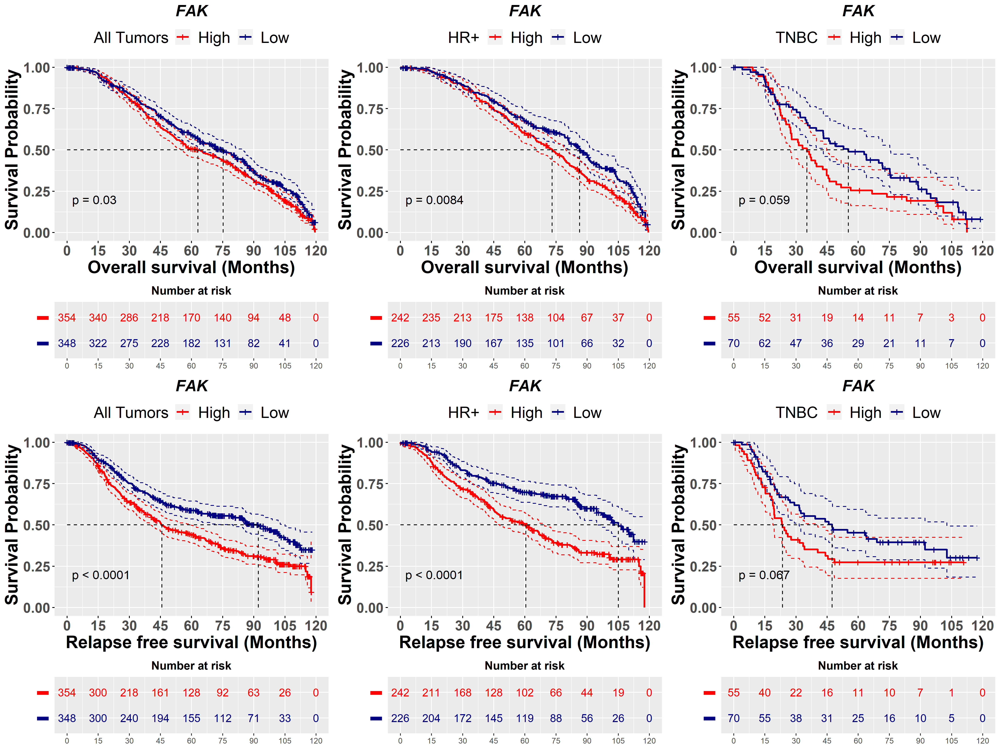
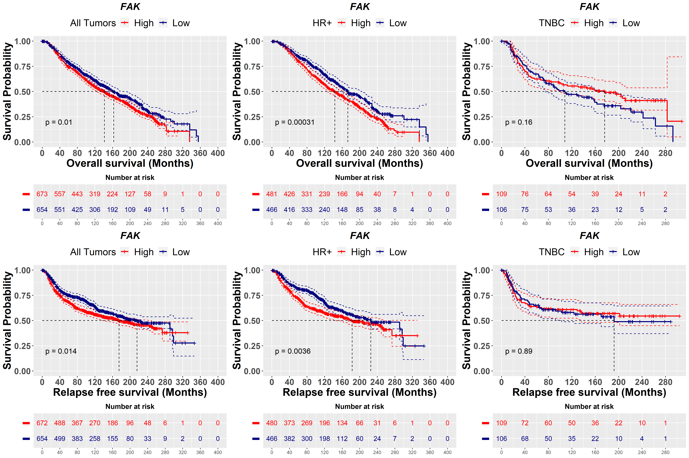

### FAK Analysis

```R
rm(list=ls())
options(warn=-1)
sw = suppressPackageStartupMessages
```


```R
#load the required libraries
sw(library(dplyr))
sw(library(data.table))
sw(library(survival))
sw(library(survminer))
sw(library(limma))
sw(library(ggpubr))
sw(library(ggplot2))
sw(library(imogimap))
sw(library(immunedeconv))
sw(library(corrplot))
```


```R
df = read.delim("ptk2_mta1_data.txt", sep='\t')
dim(df)
head(df,2)
```


<style>
.list-inline {list-style: none; margin:0; padding: 0}
.list-inline>li {display: inline-block}
.list-inline>li:not(:last-child)::after {content: "\00b7"; padding: 0 .5ex}
</style>
<ol class=list-inline><li>1980</li><li>91</li></ol>


<table class="dataframe">
<caption>A data.frame: 2 × 91</caption>
<thead>
	<tr><th></th><th scope=col>PATIENT_ID</th><th scope=col>PTK2</th><th scope=col>MTA1</th><th scope=col>ESR1</th><th scope=col>PGR</th><th scope=col>AR</th><th scope=col>NR3C1</th><th scope=col>ERBB2</th><th scope=col>VDR</th><th scope=col>AGE_AT_DIAGNOSIS</th><th scope=col>⋯</th><th scope=col>BMI1</th><th scope=col>ITGA6</th><th scope=col>KLF4</th><th scope=col>CXCR1</th><th scope=col>SALL4</th><th scope=col>SOX2</th><th scope=col>MYC</th><th scope=col>THY1</th><th scope=col>CXCR4</th><th scope=col>Breast.Stemness</th></tr>
	<tr><th></th><th scope=col>&lt;chr&gt;</th><th scope=col>&lt;dbl&gt;</th><th scope=col>&lt;dbl&gt;</th><th scope=col>&lt;dbl&gt;</th><th scope=col>&lt;dbl&gt;</th><th scope=col>&lt;dbl&gt;</th><th scope=col>&lt;dbl&gt;</th><th scope=col>&lt;dbl&gt;</th><th scope=col>&lt;dbl&gt;</th><th scope=col>&lt;dbl&gt;</th><th scope=col>⋯</th><th scope=col>&lt;dbl&gt;</th><th scope=col>&lt;dbl&gt;</th><th scope=col>&lt;dbl&gt;</th><th scope=col>&lt;dbl&gt;</th><th scope=col>&lt;dbl&gt;</th><th scope=col>&lt;dbl&gt;</th><th scope=col>&lt;dbl&gt;</th><th scope=col>&lt;dbl&gt;</th><th scope=col>&lt;dbl&gt;</th><th scope=col>&lt;dbl&gt;</th></tr>
</thead>
<tbody>
	<tr><th scope=row>1</th><td>MB-0362</td><td>10.03299</td><td>9.369428</td><td>9.082492</td><td>6.120169</td><td>8.233007</td><td>5.817897</td><td>10.87260</td><td>5.743896</td><td>52.79</td><td>⋯</td><td>10.117627</td><td>5.625142</td><td>7.056964</td><td>5.533096</td><td>6.388774</td><td>5.188634</td><td>8.772560</td><td>9.769600</td><td>9.834751</td><td>7.952139</td></tr>
	<tr><th scope=row>2</th><td>MB-0346</td><td>10.71570</td><td>9.173158</td><td>6.017776</td><td>5.291619</td><td>9.311037</td><td>5.569961</td><td>13.83604</td><td>5.884860</td><td>32.61</td><td>⋯</td><td> 8.524905</td><td>5.768592</td><td>7.036253</td><td>5.391940</td><td>5.783726</td><td>5.227100</td><td>9.208084</td><td>8.685478</td><td>9.308501</td><td>7.651031</td></tr>
</tbody>
</table>


```R

```


```R
#Check the 33 quantile of the data
q1 = quantile(df$PTK2,0.33)
q2 = quantile(df$PTK2,0.66)
q1
q2
```


<strong>33%:</strong> 10.3411211847


<strong>66%:</strong> 10.709095932


```R
#segregate sample into high, low and moderate samples
df$PTK2Group = with(df,
                        ifelse(PTK2 <= q1, 'Low',
                               ifelse(PTK2 > q1 & PTK2 < q2, 'Moderate',
                                      ifelse(PTK2 >= q2, 'High', 'unknown'))))
table(df$PTK2Group)
```


    
        High      Low Moderate 
         673      654      653 


```R
#create a local copy of the data
write.table(df, "Tall_metabric.fak.signature_grouped.txt", sep='\t')
```


```R
#Filer tnbc and hrpos samples
tnbc = filter(df, StatusGroup == "TNBC")
dim(tnbc)
hrpos = filter(df, StatusGroup == "HRPOS")
dim(hrpos)
```


<style>
.list-inline {list-style: none; margin:0; padding: 0}
.list-inline>li {display: inline-block}
.list-inline>li:not(:last-child)::after {content: "\00b7"; padding: 0 .5ex}
</style>
<ol class=list-inline><li>320</li><li>92</li></ol>


<style>
.list-inline {list-style: none; margin:0; padding: 0}
.list-inline>li {display: inline-block}
.list-inline>li:not(:last-child)::after {content: "\00b7"; padding: 0 .5ex}
</style>
<ol class=list-inline><li>1413</li><li>92</li></ol>


```R
#Check the 33 quantile of the data
q1 = quantile(tnbc$PTK2,0.33)
q2 = quantile(tnbc$PTK2,0.66)

#segregate sample into high, low and moderate samples
tnbc$PTK2Group = with(tnbc,
                        ifelse(PTK2 <= q1, 'Low',
                               ifelse(PTK2 > q1 & PTK2 < q2, 'Moderate',
                                      ifelse(PTK2 >= q2, 'High', 'unknown'))))
table(tnbc$PTK2Group)
```


    
        High      Low Moderate 
         109      106      105 


```R
#Check the 33 quantile of the data
q1 = quantile(hrpos$PTK2,0.33)
q2 = quantile(hrpos$PTK2,0.66)

#segregate sample into high, low and moderate samples
hrpos$PTK2Group = with(hrpos,
                        ifelse(PTK2 <= q1, 'Low',
                               ifelse(PTK2 > q1 & PTK2 < q2, 'Moderate',
                                      ifelse(PTK2 >= q2, 'High', 'unknown'))))
table(hrpos$PTK2Group)
```


    
        High      Low Moderate 
         481      466      466 


```R
write.table(tnbc, "tnbc_metabric.fak.signature.txt", sep='\t')
write.table(hrpos, "hrpos_metabric.fak.signature.txt", sep='\t')
```


```R
#theme to center the title
centr = theme_grey() + theme(plot.title = element_text(hjust = 0.5, face = "bold"))
```


```R
#Filter by high and low group
GR = filter(df, PTK2Group == "High" | PTK2Group == "Low")
GR = arrange(GR, PTK2Group)
table(GR$PTK2Group)
dim(GR)
#set 120 months cut-off for survival analysis
GR_M = filter(GR, OS_MONTHS <= 120)
dim(GR_M)
```


    
    High  Low 
     673  654 


<style>
.list-inline {list-style: none; margin:0; padding: 0}
.list-inline>li {display: inline-block}
.list-inline>li:not(:last-child)::after {content: "\00b7"; padding: 0 .5ex}
</style>
<ol class=list-inline><li>1327</li><li>92</li></ol>


<style>
.list-inline {list-style: none; margin:0; padding: 0}
.list-inline>li {display: inline-block}
.list-inline>li:not(:last-child)::after {content: "\00b7"; padding: 0 .5ex}
</style>
<ol class=list-inline><li>702</li><li>92</li></ol>


```R
#Filter respective high and low group each nuclear receptors
GRhrpos = filter(hrpos, PTK2Group == "High" | PTK2Group == "Low")
GRhrpos = arrange(GRhrpos, PTK2Group)
# table(GRhrpos$PTK2Group)
# dim(GRhrpos)

#set 120 months cut-off for survival analysis
GRhrpos_M = filter(GRhrpos, OS_MONTHS <= 120)
# dim(GRhrpos_M)

#Filter respective high and low group each nuclear receptors
GRtnbc = filter(tnbc, PTK2Group == "High" | PTK2Group == "Low")
GRtnbc = arrange(GRtnbc, PTK2Group)
# table(GRtnbc$PTK2Group)
# dim(GRtnbc)

#set 120 months cut-off for survival analysis
GRtnbc_M = filter(GRtnbc, OS_MONTHS <= 120)
# dim(GRtnbc_M)
```


<style>
.list-inline {list-style: none; margin:0; padding: 0}
.list-inline>li {display: inline-block}
.list-inline>li:not(:last-child)::after {content: "\00b7"; padding: 0 .5ex}
</style>
<ol class=list-inline><li>125</li><li>92</li></ol>


```R
fit1 = survfit(Surv(OS_MONTHS, OS_STATUS)~PTK2Group, data=GR_M)
fit2 = survfit(Surv(RFS_MONTHS, RFS_STATUS)~PTK2Group, data=GR_M)

fit3 = survfit(Surv(OS_MONTHS, OS_STATUS)~PTK2Group, data=GRhrpos_M)
fit4 = survfit(Surv(RFS_MONTHS, RFS_STATUS)~PTK2Group, data=GRhrpos_M)

fit5 = survfit(Surv(OS_MONTHS, OS_STATUS)~PTK2Group, data=GRtnbc_M)
fit6 = survfit(Surv(RFS_MONTHS, RFS_STATUS)~PTK2Group, data=GRtnbc_M)
```


```R
splots <- list()
```


```R
#Survival for GR
gr=ggsurvplot(fit1, pval=TRUE, risk.table=TRUE, risk.table.col = "strata", conf.int = TRUE, conf.int.style = "step",
           xlab = "Overall survival (Months)", break.x.by=15, font.x = c(20, face = "bold"), font.tickslab = c(16, "bold"),
           ylab="Survival Probability", font.y = c(20, face = "bold"), tables.y.text = FALSE,
           legend.labs=c("High", "Low"), font.legend = c(18), legend.title="All Tumors", title="FAK", font.title=c(18, "bold.italic"),
           size=1,  ggtheme = centr, surv.median.line = "hv", palette = c("red", "navy"))
gr$table = gr$table + labs(x = NULL, y = NULL)
splots[[1]]=gr

gr2=ggsurvplot(fit2, pval=TRUE, risk.table=TRUE, risk.table.col = "strata", conf.int = TRUE, conf.int.style = "step",
           xlab = "Relapse free survival (Months)", break.x.by=15, font.x = c(20, face = "bold"), font.tickslab = c(16, "bold"),
           ylab="Survival Probability", font.y = c(20, face = "bold"), tables.y.text = FALSE,
           legend.labs=c("High", "Low"), font.legend = c(18), legend.title="All Tumors", title="FAK", font.title=c(18, "bold.italic"),
           size=1,  ggtheme = centr, surv.median.line = "hv", palette = c("red", "navy"))
gr2$table = gr2$table + labs(x = NULL, y = NULL)
splots[[2]] = gr2

gr3=ggsurvplot(fit3, pval=TRUE, risk.table=TRUE, risk.table.col = "strata", conf.int = TRUE, conf.int.style = "step",
           xlab = "Overall survival (Months)", break.x.by=15, font.x = c(20, face = "bold"), font.tickslab = c(16, "bold"),
           ylab="Survival Probability", font.y = c(20, face = "bold"), tables.y.text = FALSE,
           legend.labs=c("High", "Low"), font.legend = c(18), legend.title="HR+", title="FAK", font.title=c(18, "bold.italic"),
           size=1,  ggtheme = centr, surv.median.line = "hv", palette = c("red", "navy"))
gr3$table = gr3$table + labs(x = NULL, y = NULL)
splots[[3]]=gr3

gr4=ggsurvplot(fit4, pval=TRUE, risk.table=TRUE, risk.table.col = "strata", conf.int = TRUE, conf.int.style = "step",
           xlab = "Relapse free survival (Months)", break.x.by=15, font.x = c(20, face = "bold"), font.tickslab = c(16, "bold"),
           ylab="Survival Probability", font.y = c(20, face = "bold"), tables.y.text = FALSE,
           legend.labs=c("High", "Low"), font.legend = c(18), legend.title="HR+", title="FAK", font.title=c(18, "bold.italic"),
           size=1,  ggtheme = centr, surv.median.line = "hv", palette = c("red", "navy"))
gr4$table = gr4$table + labs(x = NULL, y = NULL)
splots[[4]] = gr4

gr5=ggsurvplot(fit5, pval=TRUE, risk.table=TRUE, risk.table.col = "strata", conf.int = TRUE, conf.int.style = "step",
           xlab = "Overall survival (Months)", break.x.by=15, font.x = c(20, face = "bold"), font.tickslab = c(16, "bold"),
           ylab="Survival Probability", font.y = c(20, face = "bold"), tables.y.text = FALSE,
           legend.labs=c("High", "Low"), font.legend = c(18), legend.title="TNBC", title="FAK", font.title=c(18, "bold.italic"),
           size=1,  ggtheme = centr, surv.median.line = "hv", palette = c("red", "navy"))
gr5$table = gr5$table + labs(x = NULL, y = NULL)
splots[[5]]=gr5

gr6=ggsurvplot(fit6, pval=TRUE, risk.table=TRUE, risk.table.col = "strata", conf.int = TRUE, conf.int.style = "step",
           xlab = "Relapse free survival (Months)", break.x.by=15, font.x = c(20, face = "bold"), font.tickslab = c(16, "bold"),
           ylab="Survival Probability", font.y = c(20, face = "bold"), tables.y.text = FALSE,
           legend.labs=c("High", "Low"), font.legend = c(18), legend.title="TNBC", title="FAK", font.title=c(18, "bold.italic"),
           size=1,  ggtheme = centr, surv.median.line = "hv", palette = c("red", "navy"))
gr6$table = gr6$table + labs(x = NULL, y = NULL)
splots[[6]] = gr6
```


```R
m=arrange_ggsurvplots(splots, print = TRUE, ncol = 3, nrow = 2, risk.table.height = 0.25)
png(file="FAK_survival.png", width=16, height=12, units="in", res=300)
m
dev.off()
```


    [[1]]
    NULL
    


<strong>png:</strong> 2


    

    


```R
fit1 = survfit(Surv(OS_MONTHS, OS_STATUS)~PTK2Group, data=GR)
fit2 = survfit(Surv(RFS_MONTHS, RFS_STATUS)~PTK2Group, data=GR)

fit3 = survfit(Surv(OS_MONTHS, OS_STATUS)~PTK2Group, data=GRhrpos)
fit4 = survfit(Surv(RFS_MONTHS, RFS_STATUS)~PTK2Group, data=GRhrpos)

fit5 = survfit(Surv(OS_MONTHS, OS_STATUS)~PTK2Group, data=GRtnbc)
fit6 = survfit(Surv(RFS_MONTHS, RFS_STATUS)~PTK2Group, data=GRtnbc)
```


```R
#Survival for GR
gr=ggsurvplot(fit1, pval=TRUE, risk.table=TRUE, risk.table.col = "strata", conf.int = TRUE, conf.int.style = "step",
           xlab = "Overall survival (Months)", break.x.by=40, font.x = c(20, face = "bold"), font.tickslab = c(16, "bold"),
           ylab="Survival Probability", font.y = c(20, face = "bold"), tables.y.text = FALSE,
           legend.labs=c("High", "Low"), font.legend = c(18), legend.title="All Tumors", title="FAK", font.title=c(18, "bold.italic"),
           size=1,  ggtheme = centr, surv.median.line = "hv", palette = c("red", "navy"))
gr$table = gr$table + labs(x = NULL, y = NULL)
splots[[1]]=gr

gr2=ggsurvplot(fit2, pval=TRUE, risk.table=TRUE, risk.table.col = "strata", conf.int = TRUE, conf.int.style = "step",
           xlab = "Relapse free survival (Months)", break.x.by=40, font.x = c(20, face = "bold"), font.tickslab = c(16, "bold"),
           ylab="Survival Probability", font.y = c(20, face = "bold"), tables.y.text = FALSE,
           legend.labs=c("High", "Low"), font.legend = c(18), legend.title="All Tumors", title="FAK", font.title=c(18, "bold.italic"),
           size=1,  ggtheme = centr, surv.median.line = "hv", palette = c("red", "navy"))
gr2$table = gr2$table + labs(x = NULL, y = NULL)
splots[[2]] = gr2

gr3=ggsurvplot(fit3, pval=TRUE, risk.table=TRUE, risk.table.col = "strata", conf.int = TRUE, conf.int.style = "step",
           xlab = "Overall survival (Months)", break.x.by=40, font.x = c(20, face = "bold"), font.tickslab = c(16, "bold"),
           ylab="Survival Probability", font.y = c(20, face = "bold"), tables.y.text = FALSE,
           legend.labs=c("High", "Low"), font.legend = c(18), legend.title="HR+", title="FAK", font.title=c(18, "bold.italic"),
           size=1,  ggtheme = centr, surv.median.line = "hv", palette = c("red", "navy"))
gr3$table = gr3$table + labs(x = NULL, y = NULL)
splots[[3]]=gr3

gr4=ggsurvplot(fit4, pval=TRUE, risk.table=TRUE, risk.table.col = "strata", conf.int = TRUE, conf.int.style = "step",
           xlab = "Relapse free survival (Months)", break.x.by=40, font.x = c(20, face = "bold"), font.tickslab = c(16, "bold"),
           ylab="Survival Probability", font.y = c(20, face = "bold"), tables.y.text = FALSE,
           legend.labs=c("High", "Low"), font.legend = c(18), legend.title="HR+", title="FAK", font.title=c(18, "bold.italic"),
           size=1,  ggtheme = centr, surv.median.line = "hv", palette = c("red", "navy"))
gr4$table = gr4$table + labs(x = NULL, y = NULL)
splots[[4]] = gr4

gr5=ggsurvplot(fit5, pval=TRUE, risk.table=TRUE, risk.table.col = "strata", conf.int = TRUE, conf.int.style = "step",
           xlab = "Overall survival (Months)", break.x.by=40, font.x = c(20, face = "bold"), font.tickslab = c(16, "bold"),
           ylab="Survival Probability", font.y = c(20, face = "bold"), tables.y.text = FALSE,
           legend.labs=c("High", "Low"), font.legend = c(18), legend.title="TNBC", title="FAK", font.title=c(18, "bold.italic"),
           size=1,  ggtheme = centr, surv.median.line = "hv", palette = c("red", "navy"))
gr5$table = gr5$table + labs(x = NULL, y = NULL)
splots[[5]]=gr5

gr6=ggsurvplot(fit6, pval=TRUE, risk.table=TRUE, risk.table.col = "strata", conf.int = TRUE, conf.int.style = "step",
           xlab = "Relapse free survival (Months)", break.x.by=40, font.x = c(20, face = "bold"), font.tickslab = c(16, "bold"),
           ylab="Survival Probability", font.y = c(20, face = "bold"), tables.y.text = FALSE,
           legend.labs=c("High", "Low"), font.legend = c(18), legend.title="TNBC", title="FAK", font.title=c(18, "bold.italic"),
           size=1,  ggtheme = centr, surv.median.line = "hv", palette = c("red", "navy"))
gr6$table = gr6$table + labs(x = NULL, y = NULL)
splots[[6]] = gr6
```


```R
m=arrange_ggsurvplots(splots, print = TRUE, ncol = 3, nrow = 2, risk.table.height = 0.25)
png(file="FAK_survival_all.png", width=18, height=12, units="in", res=300)
m
dev.off()
```


    [[1]]
    NULL
    


<strong>png:</strong> 2


    

    


```R
colnames(df)
```


<style>
.list-inline {list-style: none; margin:0; padding: 0}
.list-inline>li {display: inline-block}
.list-inline>li:not(:last-child)::after {content: "\00b7"; padding: 0 .5ex}
</style>
<ol class=list-inline><li>'PATIENT_ID'</li><li>'PTK2'</li><li>'MTA1'</li><li>'ESR1'</li><li>'PGR'</li><li>'AR'</li><li>'NR3C1'</li><li>'ERBB2'</li><li>'VDR'</li><li>'AGE_AT_DIAGNOSIS'</li><li>'OS_MONTHS'</li><li>'OS_STATUS'</li><li>'RFS_STATUS'</li><li>'RFS_MONTHS'</li><li>'ER_STATUS'</li><li>'HER2_STATUS'</li><li>'PR_STATUS'</li><li>'LYMPH_NODES_EXAMINED_POSITIVE'</li><li>'NPI'</li><li>'CELLULARITY'</li><li>'CHEMOTHERAPY'</li><li>'COHORT'</li><li>'ER_IHC'</li><li>'HER2_SNP6'</li><li>'HORMONE_THERAPY'</li><li>'INFERRED_MENOPAUSAL_STATE'</li><li>'SEX'</li><li>'INTCLUST'</li><li>'CLAUDIN_SUBTYPE'</li><li>'THREEGENE'</li><li>'VITAL_STATUS'</li><li>'LATERALITY'</li><li>'RADIO_THERAPY'</li><li>'HISTOLOGICAL_SUBTYPE'</li><li>'BREAST_SURGERY'</li><li>'CANCER_TYPE_DETAILED'</li><li>'GRADE'</li><li>'ONCOTREE_CODE'</li><li>'TUMOR_SIZE'</li><li>'TUMOR_STAGE'</li><li>'TMB_NONSYNONYMOUS'</li><li>'HormoneGroup'</li><li>'StatusGroup'</li><li>'B.cells.naive'</li><li>'B.cells.memory'</li><li>'Plasma.cells'</li><li>'T.cells.CD8'</li><li>'T.cells.CD4.naive'</li><li>'T.cells.CD4.memory.resting'</li><li>'T.cells.CD4.memory.activated'</li><li>'T.cells.follicular.helper'</li><li>'T.cells.regulatory'</li><li>'T.cells.gamma.delta'</li><li>'NK.cells.resting'</li><li>'NK.cells.activated'</li><li>'Monocytes'</li><li>'Macrophages.M0'</li><li>'Macrophages.M1'</li><li>'Macrophages.M2'</li><li>'Dendritic.cells.resting'</li><li>'Dendritic.cells.activated'</li><li>'Mast.cells.resting'</li><li>'Mast.cells.activated'</li><li>'Eosinophils'</li><li>'Neutrophils'</li><li>'P.value'</li><li>'Correlation'</li><li>'RMSE'</li><li>'Absolute.score'</li><li>'EMT'</li><li>'CYT'</li><li>'CD44'</li><li>'ALDH1A1'</li><li>'PROM1'</li><li>'Stemness'</li><li>'MKI67'</li><li>'MCM6'</li><li>'PCNA'</li><li>'Proliferation'</li><li>'EPCAM'</li><li>'CD24'</li><li>'BMI1'</li><li>'ITGA6'</li><li>'KLF4'</li><li>'CXCR1'</li><li>'SALL4'</li><li>'SOX2'</li><li>'MYC'</li><li>'THY1'</li><li>'CXCR4'</li><li>'Breast.Stemness'</li><li>'PTK2Group'</li></ol>


```R
p1=ggboxplot(GR, x = "PTK2Group", y = "Proliferation", xlab="All Tumors", ylab= "Proliferation", legend = "none", width =0.5, size=0.8,
color="PTK2Group", palette = c("red", "navy"), bxp.errorbar = TRUE) + stat_compare_means(label = "p.format", label.x = 1.5, face="bold", size=6) + 
theme_grey() + font("xylab", size = 15, face = "bold") + font("xy.text", size = 14, color = "#606060")

p2=ggboxplot(GRhrpos, x = "PTK2Group", y = "Proliferation", xlab="HR+", ylab= "Proliferation", legend = "none", width =0.5, size=0.8,
color="PTK2Group", palette = c("red", "navy"), bxp.errorbar = TRUE) + stat_compare_means(label = "p.format", label.x = 1.5, face="bold", size=6) + 
theme_grey() + font("xylab", size = 15, face = "bold") + font("xy.text", size = 14, color = "#606060")

p3=ggboxplot(GRtnbc, x = "PTK2Group", y = "Proliferation", xlab="TNBC", ylab= "Proliferation", legend = "none", width =0.5, size=0.8,
color="PTK2Group", palette = c("red", "navy"), bxp.errorbar = TRUE) + stat_compare_means(label = "p.format", label.x = 1.5, face="bold", size=6) + 
theme_grey() + font("xylab", size = 15, face = "bold") + font("xy.text", size = 14, color = "#606060")

p4=ggboxplot(GR, x = "PTK2Group", y = "Breast.Stemness", xlab="All Tumors", ylab= "Stemness", legend = "none", width =0.5, size=0.8,
color="PTK2Group", palette = c("red", "navy"), bxp.errorbar = TRUE) + stat_compare_means(label = "p.format", label.x = 1.5, face="bold", size=6) + 
theme_grey() + font("xylab", size = 15, face = "bold") + font("xy.text", size = 14, color = "#606060")

p5=ggboxplot(GRhrpos, x = "PTK2Group", y = "Breast.Stemness", xlab="HR+", ylab= "Stemness", legend = "none", width =0.5, size=0.8,
color="PTK2Group", palette = c("red", "navy"), bxp.errorbar = TRUE) + stat_compare_means(label = "p.format", label.x = 1.5, face="bold", size=6) + 
theme_grey() + font("xylab", size = 15, face = "bold") + font("xy.text", size = 14, color = "#606060")

p6=ggboxplot(GRtnbc, x = "PTK2Group", y = "Breast.Stemness", xlab="TNBC", ylab= "Stemness", legend = "none", width =0.5, size=0.8,
color="PTK2Group", palette = c("red", "navy"), bxp.errorbar = TRUE) + stat_compare_means(label = "p.format", label.x = 1.5, face="bold", size=6) + 
theme_grey() + font("xylab", size = 15, face = "bold") + font("xy.text", size = 14, color = "#606060")
```


```R
ggarrange(p1,p2,p3,p4,p5,p6, labels = c("A", "B", "C", "D", "E", "F"), ncol = 3, nrow = 2, common.legend = T)
ggsave('GR.Proliferation.Stemness.png', width=16, height=12, units="in", dpi=300)
```


    

    


```R
p1=ggboxplot(GR, x = "PTK2Group", y = "CYT", xlab="All Tumors", ylab= "Cytolytic Activity", legend = "none", width =0.5, size=0.8,
color="PTK2Group", palette = c("red", "navy"), bxp.errorbar = TRUE) + stat_compare_means(label = "p.format", label.x = 1.5, face="bold", size=6) + 
theme_grey() + font("xylab", size = 15, face = "bold") + font("xy.text", size = 14, color = "#606060")

p2=ggboxplot(GRhrpos, x = "PTK2Group", y = "CYT", xlab="HR+", ylab= "Cytolytic Activity", legend = "none", width =0.5, size=0.8,
color="PTK2Group", palette = c("red", "navy"), bxp.errorbar = TRUE) + stat_compare_means(label = "p.format", label.x = 1.5, face="bold", size=6) + 
theme_grey() + font("xylab", size = 15, face = "bold") + font("xy.text", size = 14, color = "#606060")

p3=ggboxplot(GRtnbc, x = "PTK2Group", y = "CYT", xlab="TNBC", ylab= "Cytolytic Activity", legend = "none", width =0.5, size=0.8,
color="PTK2Group", palette = c("red", "navy"), bxp.errorbar = TRUE) + stat_compare_means(label = "p.format", label.x = 1.5, face="bold", size=6) + 
theme_grey() + font("xylab", size = 15, face = "bold") + font("xy.text", size = 14, color = "#606060")

p4=ggboxplot(GR, x = "PTK2Group", y = "EMT", xlab="All Tumors", ylab= "EMT Activity", legend = "none", width =0.5, size=0.8,
color="PTK2Group", palette = c("red", "navy"), bxp.errorbar = TRUE) + stat_compare_means(label = "p.format", label.x = 1.5, face="bold", size=6) + 
theme_grey() + font("xylab", size = 15, face = "bold") + font("xy.text", size = 14, color = "#606060")

p5=ggboxplot(GRhrpos, x = "PTK2Group", y = "EMT", xlab="HR+", ylab= "EMT Activity", legend = "none", width =0.5, size=0.8,
color="PTK2Group", palette = c("red", "navy"), bxp.errorbar = TRUE) + stat_compare_means(label = "p.format", label.x = 1.5, face="bold", size=6) + 
theme_grey() + font("xylab", size = 15, face = "bold") + font("xy.text", size = 14, color = "#606060")

p6=ggboxplot(GRtnbc, x = "PTK2Group", y = "EMT", xlab="TNBC", ylab= "EMT Activity", legend = "none", width =0.5, size=0.8,
color="PTK2Group", palette = c("red", "navy"), bxp.errorbar = TRUE) + stat_compare_means(label = "p.format", label.x = 1.5, face="bold", size=6) + 
theme_grey() + font("xylab", size = 15, face = "bold") + font("xy.text", size = 14, color = "#606060")
```


```R
ggarrange(p1,p2,p3,p4,p5,p6, labels = c("A", "B", "C", "D", "E", "F"), ncol = 3, nrow = 2, common.legend = T)
ggsave('GR.EMT.CytolyticActivity.png', width=16, height=12, units="in", dpi=300)
```


    

    


```R

```


```R
Do this for angioscore as well as ifng score
```


