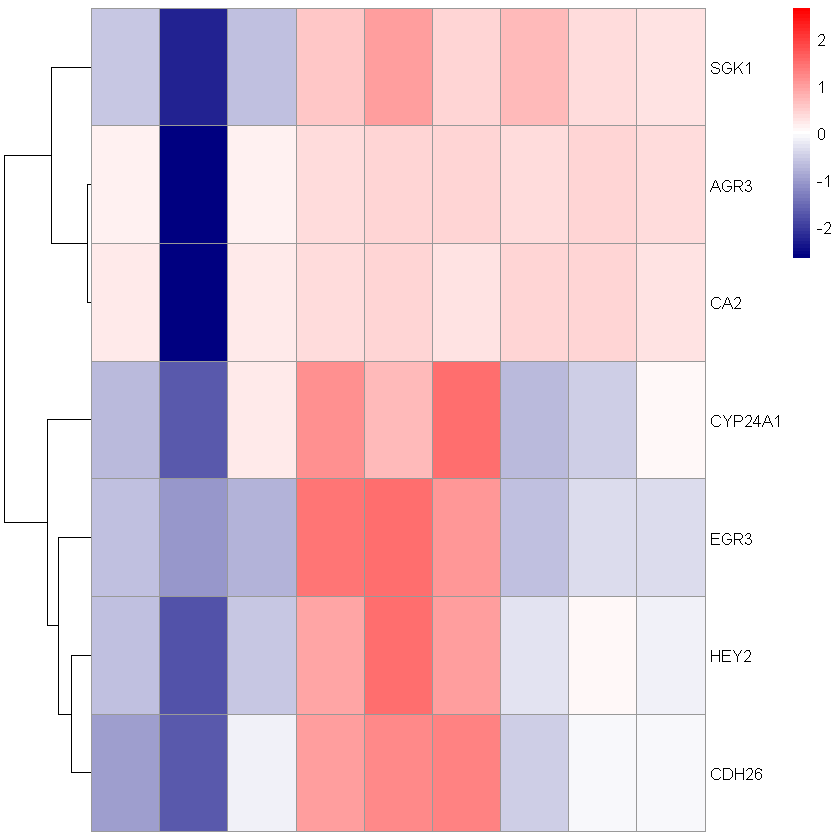

```R
#load required packages
library(pheatmap)
library(RColorBrewer)
```


```R
setwd(r"(D:\tutorial)") #set the working directory
```


```R
list.files()
```


```R
#read the expression matrix
df = read.table('test_heatmap.txt', sep='\t', header = T, row.names = 1)
dim(df)
head(df,4)
```


<style>
.list-inline {list-style: none; margin:0; padding: 0}
.list-inline>li {display: inline-block}
.list-inline>li:not(:last-child)::after {content: "\00b7"; padding: 0 .5ex}
</style>
<ol class=list-inline><li>100</li><li>9</li></ol>


<table class="dataframe">
<caption>A data.frame: 4 × 9</caption>
<thead>
	<tr><th></th><th scope=col>GSM2102086_1V</th><th scope=col>GSM2102087_2V</th><th scope=col>GSM2102088_3V</th><th scope=col>GSM2102089_1E2</th><th scope=col>GSM2102090_2E2</th><th scope=col>GSM2102091_3E2</th><th scope=col>GSM2102092_1D</th><th scope=col>GSM2102093_2D</th><th scope=col>GSM2102094_3D</th></tr>
	<tr><th></th><th scope=col>&lt;dbl&gt;</th><th scope=col>&lt;dbl&gt;</th><th scope=col>&lt;dbl&gt;</th><th scope=col>&lt;dbl&gt;</th><th scope=col>&lt;dbl&gt;</th><th scope=col>&lt;dbl&gt;</th><th scope=col>&lt;dbl&gt;</th><th scope=col>&lt;dbl&gt;</th><th scope=col>&lt;dbl&gt;</th></tr>
</thead>
<tbody>
	<tr><th scope=row>HEY2</th><td> 5.937974</td><td>4.094673</td><td> 6.056986</td><td> 8.536674</td><td> 9.415217</td><td> 8.648924</td><td> 6.507287</td><td> 7.147554</td><td> 6.728376</td></tr>
	<tr><th scope=row>AGR3</th><td>12.007406</td><td>3.597490</td><td>11.905939</td><td>12.516801</td><td>12.826134</td><td>12.674784</td><td>12.601692</td><td>12.690607</td><td>12.527396</td></tr>
	<tr><th scope=row>CDH26</th><td> 5.864334</td><td>4.762492</td><td> 7.142439</td><td> 8.926613</td><td> 9.310084</td><td> 9.344273</td><td> 6.641717</td><td> 7.274452</td><td> 7.245464</td></tr>
	<tr><th scope=row>CYP24A1</th><td> 5.839404</td><td>4.159810</td><td> 7.421337</td><td> 8.983566</td><td> 8.322051</td><td> 9.596755</td><td> 5.873634</td><td> 6.189026</td><td> 7.156007</td></tr>
</tbody>
</table>


```R
#generate heatmap
b=pheatmap(df)
```


    

    


```R
#save the file to local
png(file="heatmap_genes.png", width=6, height=16, units="in", res=300)
b
dev.off()
```


<strong>png:</strong> 2


```R
b=pheatmap(df, scale = "column") #scale function
```


    

    


```R
png(file="heatmap_genes3.png", width=6, height=16, units="in", res=300)
b
dev.off()
```


<strong>png:</strong> 2


```R
b=pheatmap(df, scale = "row")
```


    

    


```R
#change colors and remove clusters
b=pheatmap(df, scale="row",
           cluster_cols=FALSE,
           show_colnames=FALSE,
           colorRampPalette(c("navy", "white", "red"))(75))
```


    

    


```R
png(file="heatmap_genes2.png", width=6, height=16, units="in", res=300)
b
dev.off()
```


<strong>png:</strong> 2


```R
#custom genes from the matric
genes = c("HEY2", "AGR3", "CDH26", "CYP24A1", "SGK1", "EGR3", "CA2")
```


```R
b=pheatmap(df[rownames(df) %in% genes,], scale="row",
           cluster_cols=FALSE,
           show_colnames=F,
           colorRampPalette(c("navy", "white", "red"))(75))
```


    

    


```R
#adding gene annotation
gene_info = read.table('gene_info.txt', sep='\t', header = T, row.names = 1)
dim(gene_info)
head(gene_info,3)
```


<style>
.list-inline {list-style: none; margin:0; padding: 0}
.list-inline>li {display: inline-block}
.list-inline>li:not(:last-child)::after {content: "\00b7"; padding: 0 .5ex}
</style>
<ol class=list-inline><li>100</li><li>2</li></ol>


<table class="dataframe">
<caption>A data.frame: 3 × 2</caption>
<thead>
	<tr><th></th><th scope=col>Groups</th><th scope=col>Cluster</th></tr>
	<tr><th></th><th scope=col>&lt;chr&gt;</th><th scope=col>&lt;chr&gt;</th></tr>
</thead>
<tbody>
	<tr><th scope=row>HEY2</th><td>Activators</td><td>Cluster1</td></tr>
	<tr><th scope=row>AGR3</th><td>Activators</td><td>Cluster2</td></tr>
	<tr><th scope=row>CDH26</th><td>Activators</td><td>Cluster3</td></tr>
</tbody>
</table>


```R
b = pheatmap(df, annotation_row = gene_info,
             cluster_cols=FALSE,
             show_colnames=F,
             colorRampPalette(c("navy", "white", "red"))(75))
```


    

    


```R
png(file="heatmap_genes_annot.png", width=10, height=16, units="in", res=300)
b
dev.off()
```


<strong>png:</strong> 2


```R
#adding sample annotation
sam_info = read.table('sample_info.txt', sep='\t', header = T, row.names = 1)
dim(sam_info)
head(sam_info,3)
```


<style>
.list-inline {list-style: none; margin:0; padding: 0}
.list-inline>li {display: inline-block}
.list-inline>li:not(:last-child)::after {content: "\00b7"; padding: 0 .5ex}
</style>
<ol class=list-inline><li>9</li><li>1</li></ol>


<table class="dataframe">
<caption>A data.frame: 3 × 1</caption>
<thead>
	<tr><th></th><th scope=col>Group</th></tr>
	<tr><th></th><th scope=col>&lt;chr&gt;</th></tr>
</thead>
<tbody>
	<tr><th scope=row>GSM2102086_1V</th><td>Control</td></tr>
	<tr><th scope=row>GSM2102087_2V</th><td>Control</td></tr>
	<tr><th scope=row>GSM2102088_3V</th><td>Control</td></tr>
</tbody>
</table>


```R
pheatmap(df, annotation_row = gene_info, annotation_col = sam_info,
         cluster_cols=FALSE,
         show_colnames=F,
         colorRampPalette(c("navy", "white", "red"))(75))
```


    

    


```R
#divide the column
b=pheatmap(df, annotation_row = gene_info, annotation_col = sam_info,
         cluster_cols=FALSE,
         show_colnames=F,
         colorRampPalette(c("navy", "white", "red"))(75),
           gaps_col = cumsum(c(3,3,3)))
```


    

    


```R
#main = "Title"
b=pheatmap(df, annotation_row = gene_info, annotation_col = sam_info,
         cluster_cols=FALSE, main = "Gene Expression Profile",
         show_colnames=F,
         colorRampPalette(c("navy", "white", "red"))(75),
           gaps_col = cumsum(c(3,3,3)))
```


    

    


```R

```


```R
## Generating boxplots
```


```R
df = read.table('test_boxplots.txt', sep='\t', header = T, row.names = 1)
dim(df)
head(df,3)
```


<style>
.list-inline {list-style: none; margin:0; padding: 0}
.list-inline>li {display: inline-block}
.list-inline>li:not(:last-child)::after {content: "\00b7"; padding: 0 .5ex}
</style>
<ol class=list-inline><li>6</li><li>101</li></ol>


<table class="dataframe">
<caption>A data.frame: 3 × 101</caption>
<thead>
	<tr><th></th><th scope=col>HEY2</th><th scope=col>AGR3</th><th scope=col>CDH26</th><th scope=col>CYP24A1</th><th scope=col>SGK1</th><th scope=col>EGR3</th><th scope=col>CA2</th><th scope=col>HS3ST3A1</th><th scope=col>C14orf182</th><th scope=col>RASGRP1</th><th scope=col>⋯</th><th scope=col>CYP1A1</th><th scope=col>POU6F2.AS2</th><th scope=col>LOXL1.AS1</th><th scope=col>TMEM120B</th><th scope=col>PPFIBP2</th><th scope=col>TEX19</th><th scope=col>PDZK1</th><th scope=col>RHOBTB1</th><th scope=col>LAMB1</th><th scope=col>Group</th></tr>
	<tr><th></th><th scope=col>&lt;dbl&gt;</th><th scope=col>&lt;dbl&gt;</th><th scope=col>&lt;dbl&gt;</th><th scope=col>&lt;dbl&gt;</th><th scope=col>&lt;dbl&gt;</th><th scope=col>&lt;dbl&gt;</th><th scope=col>&lt;dbl&gt;</th><th scope=col>&lt;dbl&gt;</th><th scope=col>&lt;dbl&gt;</th><th scope=col>&lt;dbl&gt;</th><th scope=col>⋯</th><th scope=col>&lt;dbl&gt;</th><th scope=col>&lt;dbl&gt;</th><th scope=col>&lt;dbl&gt;</th><th scope=col>&lt;dbl&gt;</th><th scope=col>&lt;dbl&gt;</th><th scope=col>&lt;dbl&gt;</th><th scope=col>&lt;dbl&gt;</th><th scope=col>&lt;dbl&gt;</th><th scope=col>&lt;dbl&gt;</th><th scope=col>&lt;chr&gt;</th></tr>
</thead>
<tbody>
	<tr><th scope=row>GSM2102086_1V</th><td>5.937974</td><td>12.00741</td><td>5.864334</td><td>5.839404</td><td>8.809566</td><td>8.247630</td><td>12.885497</td><td>7.027847</td><td>5.891000</td><td> 9.678301</td><td>⋯</td><td>10.173121</td><td>3.041069</td><td>10.036096</td><td>7.488444</td><td>6.898904</td><td> 6.026649</td><td>5.680360</td><td>7.515250</td><td>3.577741</td><td>G1</td></tr>
	<tr><th scope=row>GSM2102087_2V</th><td>4.094673</td><td> 3.59749</td><td>4.762492</td><td>4.159810</td><td>5.868788</td><td>7.625418</td><td> 5.003062</td><td>4.590487</td><td>6.092057</td><td> 4.068158</td><td>⋯</td><td> 8.054694</td><td>8.247215</td><td> 5.974185</td><td>6.778708</td><td>9.025884</td><td>11.003784</td><td>5.030162</td><td>7.337216</td><td>8.880559</td><td>G1</td></tr>
	<tr><th scope=row>GSM2102088_3V</th><td>6.056986</td><td>11.90594</td><td>7.142439</td><td>7.421337</td><td>8.649327</td><td>8.117626</td><td>12.731758</td><td>7.065646</td><td>5.633827</td><td>10.656110</td><td>⋯</td><td>11.151212</td><td>3.143246</td><td> 9.950128</td><td>7.657618</td><td>6.702706</td><td> 6.298272</td><td>6.345612</td><td>7.753474</td><td>3.275831</td><td>G1</td></tr>
</tbody>
</table>


```R
library(ggpubr)
```

    Loading required package: ggplot2
    
    


```R
#boxplot
ggboxplot(df, x = "Group", y = "CDH26")
```


    

    


```R
#boxplot add color
ggboxplot(df, x = "Group", y = "HEY2",
         color = "Group", palette =c("red", "green"))
```


    

    


```R
#fill color
ggboxplot(df, x = "Group", y = "HEY2",
         color = "Group", palette =c("#000080", "#FF1493"),
         fill = "Group")
```


    

    


```R
#spread of data and shape
ggboxplot(df, x = "Group", y = "HEY2",
         color = "Group", palette =c("red", "green"),
         fill = "Group",
         add = "jitter", shape = "Group")
```


    

    


```R
#pvalue stat
ggboxplot(df, x = "Group", y = "HEY2",
         color = "Group", palette =c("red", "green"),
         fill = "Group",
         add = "jitter", shape = "Group") + stat_compare_means()
```


    

    


```R
#pvalue t.test
ggboxplot(df, x = "Group", y = "HEY2",
         color = "Group", palette =c("red", "green"),
         fill = "Group",
         add = "jitter", shape = "Group") + stat_compare_means(method="t.test")
```


    

    


```R

```


```R
ggviolin(df, x = "Group", y = "SGK1", fill = "Group",
         palette = c("#00AFBB", "#E7B800"),
         add = "boxplot", add.params = list(fill = "white"))+
  stat_compare_means(method="t.test") # Add significance levels
```


    

    


```R
#saving the plots generated
ggsave("vtestt.png",
       width = 5,
       height = 5,
       units = "in",
       dpi = 300)
```
