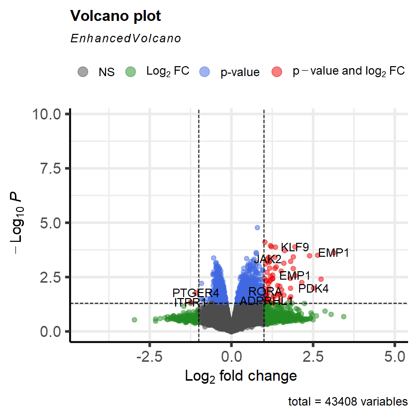
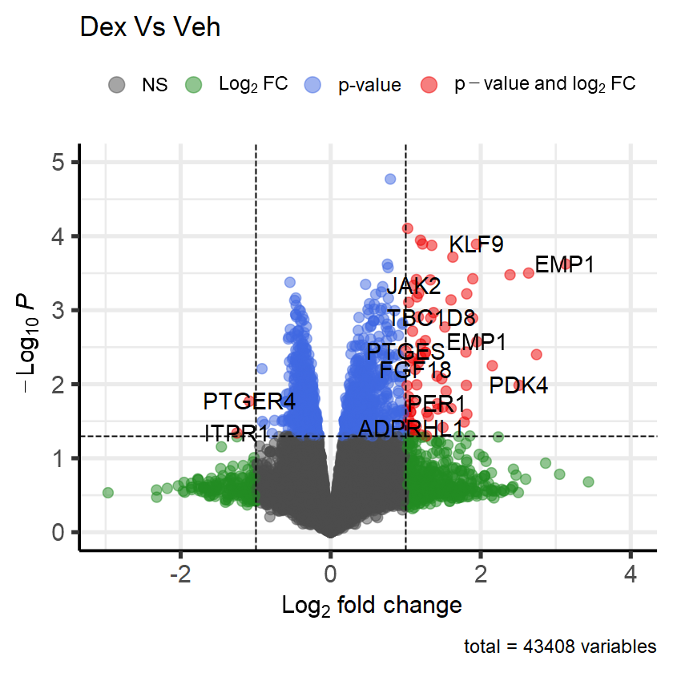

```R
setwd("D:/tutorial")
```


```R
#load required libraries
library(affy)
library(limma)
library(oligo)
library(gprofiler2)
library(dplyr)
library(EnhancedVolcano)
```


```R
list.files()
```


<style>
.list-inline {list-style: none; margin:0; padding: 0}
.list-inline>li {display: inline-block}
.list-inline>li:not(:last-child)::after {content: "\00b7"; padding: 0 .5ex}
</style>
<ol class=list-inline><li>'GSE79761_RAW.tar'</li><li>'targets.txt'</li></ol>


```R
# Set the destination folder where you want to extract the files
destination_folder = "GSE79761"

# Create the folder if it does not exist
if (!dir.exists(destination_folder)) {
    dir.create(destination_folder)
}

# Extract the tar file into the destination folder
untar("GSE79761_RAW.tar", exdir = destination_folder)

# Check the extracted files
list.files(destination_folder)
```


<style>
.list-inline {list-style: none; margin:0; padding: 0}
.list-inline>li {display: inline-block}
.list-inline>li:not(:last-child)::after {content: "\00b7"; padding: 0 .5ex}
</style>
<ol class=list-inline><li>'GSM2102086_1V.CEL.gz'</li><li>'GSM2102087_2V.CEL.gz'</li><li>'GSM2102088_3V.CEL.gz'</li><li>'GSM2102089_1E2.CEL.gz'</li><li>'GSM2102090_2E2.CEL.gz'</li><li>'GSM2102091_3E2.CEL.gz'</li><li>'GSM2102092_1D.CEL.gz'</li><li>'GSM2102093_2D.CEL.gz'</li><li>'GSM2102094_3D.CEL.gz'</li><li>'GSM2102095_1DE.CEL.gz'</li><li>'GSM2102096_2DE.CEL.gz'</li><li>'GSM2102097_3DE.CEL.gz'</li></ol>


```R
setwd("GSE79761")
```


```R
# Read files with *CEL.gz file patterns
affyRaw = read.celfiles(list.files(pattern = '*CEL.gz', full.names = TRUE))
```

    Loading required package: pd.hg.u133.plus.2
    
    Loading required package: RSQLite
    
    Loading required package: DBI
    
    Platform design info loaded.
    
    

    Reading in : ./GSM2102086_1V.CEL.gz
    Reading in : ./GSM2102087_2V.CEL.gz
    Reading in : ./GSM2102088_3V.CEL.gz
    Reading in : ./GSM2102089_1E2.CEL.gz
    Reading in : ./GSM2102090_2E2.CEL.gz
    Reading in : ./GSM2102091_3E2.CEL.gz
    Reading in : ./GSM2102092_1D.CEL.gz
    Reading in : ./GSM2102093_2D.CEL.gz
    Reading in : ./GSM2102094_3D.CEL.gz
    Reading in : ./GSM2102095_1DE.CEL.gz
    Reading in : ./GSM2102096_2DE.CEL.gz
    Reading in : ./GSM2102097_3DE.CEL.gz
    


```R
# affyRaw@assayData$exprs
```


```R
# Normaliza data
eset = rma(affyRaw, normalize=TRUE)
```

    Background correcting
    Normalizing
    Calculating Expression
    


```R
#write the normalized value to the local system
write.exprs(eset, file = "GSE79761_rma_normalized.txt")
```


```R
df = eset@assayData$exprs
dim(df)
head(df)
```


<style>
.list-inline {list-style: none; margin:0; padding: 0}
.list-inline>li {display: inline-block}
.list-inline>li:not(:last-child)::after {content: "\00b7"; padding: 0 .5ex}
</style>
<ol class=list-inline><li>54675</li><li>12</li></ol>


<table class="dataframe">
<caption>A matrix: 6 × 12 of type dbl</caption>
<thead>
	<tr><th></th><th scope=col>GSM2102086_1V.CEL.gz</th><th scope=col>GSM2102087_2V.CEL.gz</th><th scope=col>GSM2102088_3V.CEL.gz</th><th scope=col>GSM2102089_1E2.CEL.gz</th><th scope=col>GSM2102090_2E2.CEL.gz</th><th scope=col>GSM2102091_3E2.CEL.gz</th><th scope=col>GSM2102092_1D.CEL.gz</th><th scope=col>GSM2102093_2D.CEL.gz</th><th scope=col>GSM2102094_3D.CEL.gz</th><th scope=col>GSM2102095_1DE.CEL.gz</th><th scope=col>GSM2102096_2DE.CEL.gz</th><th scope=col>GSM2102097_3DE.CEL.gz</th></tr>
</thead>
<tbody>
	<tr><th scope=row>1007_s_at</th><td>11.714877</td><td>12.485145</td><td>11.332145</td><td>11.629958</td><td>11.358790</td><td>11.287053</td><td>11.660072</td><td>11.379074</td><td>11.391383</td><td>11.570162</td><td>12.359483</td><td>11.482696</td></tr>
	<tr><th scope=row>1053_at</th><td> 8.985365</td><td> 9.283224</td><td> 9.092368</td><td> 9.392458</td><td> 9.198721</td><td> 9.236350</td><td> 9.262318</td><td> 9.041983</td><td> 8.994891</td><td> 9.505972</td><td> 9.265597</td><td> 9.078676</td></tr>
	<tr><th scope=row>117_at</th><td> 6.570190</td><td> 6.053559</td><td> 6.318432</td><td> 6.569726</td><td> 6.400025</td><td> 6.400079</td><td> 6.428471</td><td> 5.945971</td><td> 6.100483</td><td> 6.449865</td><td> 5.946788</td><td> 6.378356</td></tr>
	<tr><th scope=row>121_at</th><td> 8.230666</td><td> 8.370094</td><td> 8.178881</td><td> 8.255839</td><td> 8.172376</td><td> 8.178926</td><td> 8.260911</td><td> 8.143419</td><td> 8.218729</td><td> 8.209071</td><td> 8.251734</td><td> 8.218064</td></tr>
	<tr><th scope=row>1255_g_at</th><td> 3.609922</td><td> 3.614373</td><td> 3.622583</td><td> 3.648688</td><td> 3.698928</td><td> 3.719091</td><td> 3.648238</td><td> 3.596664</td><td> 3.784828</td><td> 3.427214</td><td> 3.659637</td><td> 3.722640</td></tr>
	<tr><th scope=row>1294_at</th><td> 6.212902</td><td> 6.022737</td><td> 5.756721</td><td> 6.101646</td><td> 5.931795</td><td> 5.783782</td><td> 6.091183</td><td> 5.962472</td><td> 5.865455</td><td> 5.912867</td><td> 5.907088</td><td> 6.084677</td></tr>
</tbody>
</table>


```R
# load the targets: sample information
targets = read.table("targets.txt", header=T, sep='\t')
dim(targets)
head(targets,12)
```


<style>
.list-inline {list-style: none; margin:0; padding: 0}
.list-inline>li {display: inline-block}
.list-inline>li:not(:last-child)::after {content: "\00b7"; padding: 0 .5ex}
</style>
<ol class=list-inline><li>12</li><li>4</li></ol>


<table class="dataframe">
<caption>A data.frame: 12 × 4</caption>
<thead>
	<tr><th></th><th scope=col>SampleID</th><th scope=col>CellLine</th><th scope=col>Group</th><th scope=col>Replicate</th></tr>
	<tr><th></th><th scope=col>&lt;chr&gt;</th><th scope=col>&lt;chr&gt;</th><th scope=col>&lt;chr&gt;</th><th scope=col>&lt;chr&gt;</th></tr>
</thead>
<tbody>
	<tr><th scope=row>1</th><td>GSM2102086</td><td>MCF7</td><td>Veh   </td><td>Rep1</td></tr>
	<tr><th scope=row>2</th><td>GSM2102087</td><td>MCF7</td><td>Veh   </td><td>Rep2</td></tr>
	<tr><th scope=row>3</th><td>GSM2102088</td><td>MCF7</td><td>Veh   </td><td>Rep3</td></tr>
	<tr><th scope=row>4</th><td>GSM2102089</td><td>MCF7</td><td>Est   </td><td>Rep1</td></tr>
	<tr><th scope=row>5</th><td>GSM2102090</td><td>MCF7</td><td>Est   </td><td>Rep2</td></tr>
	<tr><th scope=row>6</th><td>GSM2102091</td><td>MCF7</td><td>Est   </td><td>Rep3</td></tr>
	<tr><th scope=row>7</th><td>GSM2102092</td><td>MCF7</td><td>Dex   </td><td>Rep1</td></tr>
	<tr><th scope=row>8</th><td>GSM2102093</td><td>MCF7</td><td>Dex   </td><td>Rep2</td></tr>
	<tr><th scope=row>9</th><td>GSM2102094</td><td>MCF7</td><td>Dex   </td><td>Rep3</td></tr>
	<tr><th scope=row>10</th><td>GSM2102095</td><td>MCF7</td><td>DexEst</td><td>Rep1</td></tr>
	<tr><th scope=row>11</th><td>GSM2102096</td><td>MCF7</td><td>DexEst</td><td>Rep2</td></tr>
	<tr><th scope=row>12</th><td>GSM2102097</td><td>MCF7</td><td>DexEst</td><td>Rep3</td></tr>
</tbody>
</table>


```R
# Modify column names of the dataframe
colnames(df) = gsub("_.*", "", colnames(df))
head(df)
```


<table class="dataframe">
<caption>A matrix: 6 × 12 of type dbl</caption>
<thead>
	<tr><th></th><th scope=col>GSM2102086</th><th scope=col>GSM2102087</th><th scope=col>GSM2102088</th><th scope=col>GSM2102089</th><th scope=col>GSM2102090</th><th scope=col>GSM2102091</th><th scope=col>GSM2102092</th><th scope=col>GSM2102093</th><th scope=col>GSM2102094</th><th scope=col>GSM2102095</th><th scope=col>GSM2102096</th><th scope=col>GSM2102097</th></tr>
</thead>
<tbody>
	<tr><th scope=row>1007_s_at</th><td>11.714877</td><td>12.485145</td><td>11.332145</td><td>11.629958</td><td>11.358790</td><td>11.287053</td><td>11.660072</td><td>11.379074</td><td>11.391383</td><td>11.570162</td><td>12.359483</td><td>11.482696</td></tr>
	<tr><th scope=row>1053_at</th><td> 8.985365</td><td> 9.283224</td><td> 9.092368</td><td> 9.392458</td><td> 9.198721</td><td> 9.236350</td><td> 9.262318</td><td> 9.041983</td><td> 8.994891</td><td> 9.505972</td><td> 9.265597</td><td> 9.078676</td></tr>
	<tr><th scope=row>117_at</th><td> 6.570190</td><td> 6.053559</td><td> 6.318432</td><td> 6.569726</td><td> 6.400025</td><td> 6.400079</td><td> 6.428471</td><td> 5.945971</td><td> 6.100483</td><td> 6.449865</td><td> 5.946788</td><td> 6.378356</td></tr>
	<tr><th scope=row>121_at</th><td> 8.230666</td><td> 8.370094</td><td> 8.178881</td><td> 8.255839</td><td> 8.172376</td><td> 8.178926</td><td> 8.260911</td><td> 8.143419</td><td> 8.218729</td><td> 8.209071</td><td> 8.251734</td><td> 8.218064</td></tr>
	<tr><th scope=row>1255_g_at</th><td> 3.609922</td><td> 3.614373</td><td> 3.622583</td><td> 3.648688</td><td> 3.698928</td><td> 3.719091</td><td> 3.648238</td><td> 3.596664</td><td> 3.784828</td><td> 3.427214</td><td> 3.659637</td><td> 3.722640</td></tr>
	<tr><th scope=row>1294_at</th><td> 6.212902</td><td> 6.022737</td><td> 5.756721</td><td> 6.101646</td><td> 5.931795</td><td> 5.783782</td><td> 6.091183</td><td> 5.962472</td><td> 5.865455</td><td> 5.912867</td><td> 5.907088</td><td> 6.084677</td></tr>
</tbody>
</table>


```R
# Remove rows where row names start with "AFFX-"
df = df[!grepl("^AFFX-", rownames(df)), ]
# Check the updated dataframe
dim(df)
```


<style>
.list-inline {list-style: none; margin:0; padding: 0}
.list-inline>li {display: inline-block}
.list-inline>li:not(:last-child)::after {content: "\00b7"; padding: 0 .5ex}
</style>
<ol class=list-inline><li>54613</li><li>12</li></ol>


```R
# Ensure expression data and target are in the same order
df = df[, targets$SampleID]
```


```R
#create design matrix based on the group
conditions = paste(targets$Group)
head(conditions)
conditions = factor(conditions, levels=unique(conditions))
conditions
```


<style>
.list-inline {list-style: none; margin:0; padding: 0}
.list-inline>li {display: inline-block}
.list-inline>li:not(:last-child)::after {content: "\00b7"; padding: 0 .5ex}
</style>
<ol class=list-inline><li>'Veh'</li><li>'Veh'</li><li>'Veh'</li><li>'Est'</li><li>'Est'</li><li>'Est'</li></ol>


<style>
.list-inline {list-style: none; margin:0; padding: 0}
.list-inline>li {display: inline-block}
.list-inline>li:not(:last-child)::after {content: "\00b7"; padding: 0 .5ex}
</style>
<ol class=list-inline><li>Veh</li><li>Veh</li><li>Veh</li><li>Est</li><li>Est</li><li>Est</li><li>Dex</li><li>Dex</li><li>Dex</li><li>DexEst</li><li>DexEst</li><li>DexEst</li></ol>

<details>
	<summary style=display:list-item;cursor:pointer>
		<strong>Levels</strong>:
	</summary>
	<style>
	.list-inline {list-style: none; margin:0; padding: 0}
	.list-inline>li {display: inline-block}
	.list-inline>li:not(:last-child)::after {content: "\00b7"; padding: 0 .5ex}
	</style>
	<ol class=list-inline><li>'Veh'</li><li>'Est'</li><li>'Dex'</li><li>'DexEst'</li></ol>
</details>


```R
#create design matrix
design = model.matrix(~0+ conditions)
colnames(design) = levels(conditions) #add column name to design matrix
```


```R
#view design matrix
design
```


<table class="dataframe">
<caption>A matrix: 12 × 4 of type dbl</caption>
<thead>
	<tr><th></th><th scope=col>Veh</th><th scope=col>Est</th><th scope=col>Dex</th><th scope=col>DexEst</th></tr>
</thead>
<tbody>
	<tr><th scope=row>1</th><td>1</td><td>0</td><td>0</td><td>0</td></tr>
	<tr><th scope=row>2</th><td>1</td><td>0</td><td>0</td><td>0</td></tr>
	<tr><th scope=row>3</th><td>1</td><td>0</td><td>0</td><td>0</td></tr>
	<tr><th scope=row>4</th><td>0</td><td>1</td><td>0</td><td>0</td></tr>
	<tr><th scope=row>5</th><td>0</td><td>1</td><td>0</td><td>0</td></tr>
	<tr><th scope=row>6</th><td>0</td><td>1</td><td>0</td><td>0</td></tr>
	<tr><th scope=row>7</th><td>0</td><td>0</td><td>1</td><td>0</td></tr>
	<tr><th scope=row>8</th><td>0</td><td>0</td><td>1</td><td>0</td></tr>
	<tr><th scope=row>9</th><td>0</td><td>0</td><td>1</td><td>0</td></tr>
	<tr><th scope=row>10</th><td>0</td><td>0</td><td>0</td><td>1</td></tr>
	<tr><th scope=row>11</th><td>0</td><td>0</td><td>0</td><td>1</td></tr>
	<tr><th scope=row>12</th><td>0</td><td>0</td><td>0</td><td>1</td></tr>
</tbody>
</table>


```R
# fit the design to the expression data
fit = lmFit(df, design)
```


```R
#make contrast matrix
contrast.matrix = makeContrasts(degs = Dex - Veh, degs2 = Est - Veh,
                                levels = design)
contrast.matrix
```


<table class="dataframe">
<caption>A matrix: 4 × 2 of type dbl</caption>
<thead>
	<tr><th></th><th scope=col>degs</th><th scope=col>degs2</th></tr>
</thead>
<tbody>
	<tr><th scope=row>Veh</th><td>-1</td><td>-1</td></tr>
	<tr><th scope=row>Est</th><td> 0</td><td> 1</td></tr>
	<tr><th scope=row>Dex</th><td> 1</td><td> 0</td></tr>
	<tr><th scope=row>DexEst</th><td> 0</td><td> 0</td></tr>
</tbody>
</table>


```R
# Fit contrast matrix
fit.cont = contrasts.fit(fit, contrast.matrix)
```


```R
# Fit ebayes
fit.cont = eBayes(fit.cont)
```


```R
res1 = topTable(fit.cont, coef = "degs", adjust.method = "BH", number = nrow(df), sort.by = 'p')
res1
```


<table class="dataframe">
<caption>A data.frame: 54613 × 6</caption>
<thead>
	<tr><th></th><th scope=col>logFC</th><th scope=col>AveExpr</th><th scope=col>t</th><th scope=col>P.Value</th><th scope=col>adj.P.Val</th><th scope=col>B</th></tr>
	<tr><th></th><th scope=col>&lt;dbl&gt;</th><th scope=col>&lt;dbl&gt;</th><th scope=col>&lt;dbl&gt;</th><th scope=col>&lt;dbl&gt;</th><th scope=col>&lt;dbl&gt;</th><th scope=col>&lt;dbl&gt;</th></tr>
</thead>
<tbody>
	<tr><th scope=row>212448_at</th><td> 0.7952617</td><td> 7.715136</td><td> 7.515879</td><td>1.690335e-05</td><td>0.8475461</td><td>-2.834918</td></tr>
	<tr><th scope=row>228865_at</th><td> 1.0253649</td><td> 5.512106</td><td> 6.289306</td><td>7.845616e-05</td><td>0.8475461</td><td>-2.979619</td></tr>
	<tr><th scope=row>203973_s_at</th><td> 1.1970560</td><td>10.202935</td><td> 6.015674</td><td>1.134178e-04</td><td>0.8475461</td><td>-3.020279</td></tr>
	<tr><th scope=row>241782_at</th><td> 1.2243888</td><td> 4.757880</td><td> 5.930873</td><td>1.274014e-04</td><td>0.8475461</td><td>-3.033627</td></tr>
	<tr><th scope=row>203542_s_at</th><td> 1.9430377</td><td> 9.142446</td><td> 5.924720</td><td>1.284856e-04</td><td>0.8475461</td><td>-3.034610</td></tr>
	<tr><th scope=row>227703_s_at</th><td> 1.3467424</td><td> 8.883694</td><td> 5.899288</td><td>1.330730e-04</td><td>0.8475461</td><td>-3.038693</td></tr>
	<tr><th scope=row>230636_s_at</th><td> 1.2840063</td><td> 6.532282</td><td> 5.798203</td><td>1.531189e-04</td><td>0.8475461</td><td>-3.055261</td></tr>
	<tr><th scope=row>223168_at</th><td> 1.6276482</td><td> 9.938139</td><td> 5.639181</td><td>1.914868e-04</td><td>0.8475461</td><td>-3.082456</td></tr>
	<tr><th scope=row>234261_at</th><td>-0.7375793</td><td> 4.591648</td><td>-5.617698</td><td>1.974129e-04</td><td>0.8475461</td><td>-3.086239</td></tr>
	<tr><th scope=row>232363_at</th><td> 0.7204464</td><td> 5.589081</td><td> 5.609836</td><td>1.996305e-04</td><td>0.8475461</td><td>-3.087631</td></tr>
	<tr><th scope=row>201324_at</th><td> 3.1314145</td><td> 7.011367</td><td> 5.486660</td><td>2.380809e-04</td><td>0.8475461</td><td>-3.109902</td></tr>
	<tr><th scope=row>1562249_at</th><td> 0.7558017</td><td> 3.635280</td><td> 5.484110</td><td>2.389561e-04</td><td>0.8475461</td><td>-3.110373</td></tr>
	<tr><th scope=row>202445_s_at</th><td> 0.7651195</td><td> 6.774628</td><td> 5.411150</td><td>2.655093e-04</td><td>0.8475461</td><td>-3.124007</td></tr>
	<tr><th scope=row>218559_s_at</th><td> 2.6383287</td><td>10.224166</td><td> 5.294149</td><td>3.148837e-04</td><td>0.8475461</td><td>-3.146564</td></tr>
	<tr><th scope=row>203543_s_at</th><td> 2.3900498</td><td> 9.127486</td><td> 5.257654</td><td>3.322211e-04</td><td>0.8475461</td><td>-3.153779</td></tr>
	<tr><th scope=row>222670_s_at</th><td> 1.8936729</td><td> 9.504714</td><td> 5.174073</td><td>3.758794e-04</td><td>0.8475461</td><td>-3.170633</td></tr>
	<tr><th scope=row>226974_at</th><td> 1.1430556</td><td> 7.216918</td><td> 5.157913</td><td>3.850048e-04</td><td>0.8475461</td><td>-3.173946</td></tr>
	<tr><th scope=row>233383_at</th><td>-0.4495825</td><td> 4.858983</td><td>-5.154666</td><td>3.868668e-04</td><td>0.8475461</td><td>-3.174614</td></tr>
	<tr><th scope=row>244353_s_at</th><td> 1.3289572</td><td> 6.833695</td><td> 5.151377</td><td>3.887620e-04</td><td>0.8475461</td><td>-3.175290</td></tr>
	<tr><th scope=row>1553391_at</th><td>-0.5431415</td><td> 4.139402</td><td>-5.099842</td><td>4.197928e-04</td><td>0.8475461</td><td>-3.185995</td></tr>
	<tr><th scope=row>231270_at</th><td> 0.4651273</td><td> 5.693016</td><td> 5.056570</td><td>4.478844e-04</td><td>0.8475461</td><td>-3.195124</td></tr>
	<tr><th scope=row>205841_at</th><td> 1.1069886</td><td> 7.759010</td><td> 5.035635</td><td>4.621867e-04</td><td>0.8475461</td><td>-3.199588</td></tr>
	<tr><th scope=row>230151_at</th><td> 0.6930578</td><td> 7.104013</td><td> 5.009770</td><td>4.805316e-04</td><td>0.8475461</td><td>-3.205145</td></tr>
	<tr><th scope=row>203962_s_at</th><td> 0.6734192</td><td>10.593867</td><td> 4.901304</td><td>5.663205e-04</td><td>0.8475461</td><td>-3.228969</td></tr>
	<tr><th scope=row>223169_s_at</th><td> 1.1723316</td><td> 7.710865</td><td> 4.873296</td><td>5.910201e-04</td><td>0.8475461</td><td>-3.235259</td></tr>
	<tr><th scope=row>227410_at</th><td> 1.8137747</td><td> 8.119707</td><td> 4.862614</td><td>6.007395e-04</td><td>0.8475461</td><td>-3.237673</td></tr>
	<tr><th scope=row>227569_at</th><td> 0.5997282</td><td>10.893658</td><td> 4.850625</td><td>6.118506e-04</td><td>0.8475461</td><td>-3.240393</td></tr>
	<tr><th scope=row>222877_at</th><td> 1.1503280</td><td> 4.873054</td><td> 4.799011</td><td>6.622342e-04</td><td>0.8475461</td><td>-3.252225</td></tr>
	<tr><th scope=row>1553284_s_at</th><td>-0.4645544</td><td> 5.170025</td><td>-4.777955</td><td>6.840354e-04</td><td>0.8475461</td><td>-3.257109</td></tr>
	<tr><th scope=row>227949_at</th><td> 0.7689198</td><td> 5.133790</td><td> 4.773531</td><td>6.887114e-04</td><td>0.8475461</td><td>-3.258140</td></tr>
	<tr><th scope=row>⋮</th><td>⋮</td><td>⋮</td><td>⋮</td><td>⋮</td><td>⋮</td><td>⋮</td></tr>
	<tr><th scope=row>215283_at</th><td>-2.403409e-04</td><td> 5.753796</td><td>-1.048097e-03</td><td>0.9991837</td><td>0.9997146</td><td>-4.809089</td></tr>
	<tr><th scope=row>227460_at</th><td>-1.534701e-04</td><td> 3.640915</td><td>-9.967379e-04</td><td>0.9992237</td><td>0.9997363</td><td>-4.809089</td></tr>
	<tr><th scope=row>215170_s_at</th><td>-3.292286e-04</td><td> 5.363076</td><td>-9.310062e-04</td><td>0.9992749</td><td>0.9997565</td><td>-4.809089</td></tr>
	<tr><th scope=row>208426_x_at</th><td> 7.893967e-05</td><td> 3.929755</td><td> 9.237986e-04</td><td>0.9992805</td><td>0.9997565</td><td>-4.809089</td></tr>
	<tr><th scope=row>201101_s_at</th><td> 1.418590e-04</td><td>11.118293</td><td> 8.786735e-04</td><td>0.9993157</td><td>0.9997733</td><td>-4.809089</td></tr>
	<tr><th scope=row>216005_at</th><td>-6.758614e-05</td><td> 3.894155</td><td>-8.484023e-04</td><td>0.9993392</td><td>0.9997782</td><td>-4.809089</td></tr>
	<tr><th scope=row>240890_at</th><td> 6.336304e-05</td><td> 3.871573</td><td> 8.189986e-04</td><td>0.9993621</td><td>0.9997782</td><td>-4.809089</td></tr>
	<tr><th scope=row>1556987_s_at</th><td>-1.195134e-04</td><td> 5.591520</td><td>-7.991231e-04</td><td>0.9993776</td><td>0.9997782</td><td>-4.809089</td></tr>
	<tr><th scope=row>1560525_at</th><td> 9.080890e-05</td><td> 4.479256</td><td> 7.784046e-04</td><td>0.9993938</td><td>0.9997782</td><td>-4.809089</td></tr>
	<tr><th scope=row>215117_at</th><td>-6.032394e-05</td><td> 3.210949</td><td>-6.521567e-04</td><td>0.9994921</td><td>0.9998433</td><td>-4.809089</td></tr>
	<tr><th scope=row>1555448_at</th><td>-1.302898e-04</td><td> 6.417103</td><td>-6.477910e-04</td><td>0.9994955</td><td>0.9998433</td><td>-4.809089</td></tr>
	<tr><th scope=row>1552586_at</th><td> 1.091079e-04</td><td> 5.570028</td><td> 5.513291e-04</td><td>0.9995706</td><td>0.9998529</td><td>-4.809089</td></tr>
	<tr><th scope=row>1566033_at</th><td>-3.930598e-05</td><td> 3.910951</td><td>-5.287355e-04</td><td>0.9995882</td><td>0.9998529</td><td>-4.809089</td></tr>
	<tr><th scope=row>1557098_s_at</th><td>-1.257625e-04</td><td> 6.062424</td><td>-5.175282e-04</td><td>0.9995969</td><td>0.9998529</td><td>-4.809089</td></tr>
	<tr><th scope=row>209812_x_at</th><td> 8.085186e-05</td><td> 6.773522</td><td> 5.070075e-04</td><td>0.9996051</td><td>0.9998529</td><td>-4.809089</td></tr>
	<tr><th scope=row>217027_x_at</th><td>-4.676716e-05</td><td> 9.199654</td><td>-4.816833e-04</td><td>0.9996249</td><td>0.9998529</td><td>-4.809089</td></tr>
	<tr><th scope=row>223427_s_at</th><td>-8.826246e-05</td><td> 7.532489</td><td>-4.668650e-04</td><td>0.9996364</td><td>0.9998529</td><td>-4.809089</td></tr>
	<tr><th scope=row>215666_at</th><td>-4.745100e-05</td><td> 3.513468</td><td>-4.494434e-04</td><td>0.9996500</td><td>0.9998529</td><td>-4.809089</td></tr>
	<tr><th scope=row>1568663_a_at</th><td> 5.849318e-05</td><td> 3.784688</td><td> 4.271278e-04</td><td>0.9996673</td><td>0.9998529</td><td>-4.809089</td></tr>
	<tr><th scope=row>235179_at</th><td> 9.864855e-05</td><td> 6.183387</td><td> 4.239842e-04</td><td>0.9996698</td><td>0.9998529</td><td>-4.809089</td></tr>
	<tr><th scope=row>208074_s_at</th><td> 5.595745e-05</td><td>11.862936</td><td> 3.287048e-04</td><td>0.9997440</td><td>0.9999088</td><td>-4.809089</td></tr>
	<tr><th scope=row>1554803_s_at</th><td> 4.574770e-05</td><td> 5.060954</td><td> 2.455331e-04</td><td>0.9998088</td><td>0.9999491</td><td>-4.809089</td></tr>
	<tr><th scope=row>1559228_at</th><td> 3.194653e-05</td><td> 4.166964</td><td> 2.230253e-04</td><td>0.9998263</td><td>0.9999491</td><td>-4.809089</td></tr>
	<tr><th scope=row>229217_at</th><td>-2.384651e-05</td><td> 6.346017</td><td>-1.740730e-04</td><td>0.9998644</td><td>0.9999491</td><td>-4.809089</td></tr>
	<tr><th scope=row>233856_at</th><td> 1.446460e-05</td><td> 3.595306</td><td> 1.628789e-04</td><td>0.9998731</td><td>0.9999491</td><td>-4.809089</td></tr>
	<tr><th scope=row>1566266_at</th><td>-1.372198e-05</td><td> 3.376231</td><td>-1.451857e-04</td><td>0.9998869</td><td>0.9999491</td><td>-4.809089</td></tr>
	<tr><th scope=row>216047_x_at</th><td>-1.793429e-05</td><td> 5.717270</td><td>-1.359024e-04</td><td>0.9998942</td><td>0.9999491</td><td>-4.809089</td></tr>
	<tr><th scope=row>226061_s_at</th><td>-6.476086e-06</td><td> 5.179055</td><td>-6.441677e-05</td><td>0.9999498</td><td>0.9999865</td><td>-4.809089</td></tr>
	<tr><th scope=row>229863_s_at</th><td> 1.966119e-06</td><td> 8.510457</td><td> 2.052152e-05</td><td>0.9999840</td><td>0.9999894</td><td>-4.809089</td></tr>
	<tr><th scope=row>243796_at</th><td>-3.021569e-06</td><td> 7.134296</td><td>-1.366904e-05</td><td>0.9999894</td><td>0.9999894</td><td>-4.809089</td></tr>
</tbody>
</table>


```R
prob = rownames(res1)
head(prob)
```


<style>
.list-inline {list-style: none; margin:0; padding: 0}
.list-inline>li {display: inline-block}
.list-inline>li:not(:last-child)::after {content: "\00b7"; padding: 0 .5ex}
</style>
<ol class=list-inline><li>'212448_at'</li><li>'228865_at'</li><li>'203973_s_at'</li><li>'241782_at'</li><li>'203542_s_at'</li><li>'227703_s_at'</li></ol>


```R
genes = gconvert(query = prob, organism = "hsapiens", target = "ENTREZGENE_ACC")
genes
```


<table class="dataframe">
<caption>A data.frame: 43408 × 7</caption>
<thead>
	<tr><th scope=col>input_number</th><th scope=col>input</th><th scope=col>target_number</th><th scope=col>target</th><th scope=col>name</th><th scope=col>description</th><th scope=col>namespace</th></tr>
	<tr><th scope=col>&lt;int&gt;</th><th scope=col>&lt;chr&gt;</th><th scope=col>&lt;chr&gt;</th><th scope=col>&lt;chr&gt;</th><th scope=col>&lt;chr&gt;</th><th scope=col>&lt;chr&gt;</th><th scope=col>&lt;chr&gt;</th></tr>
</thead>
<tbody>
	<tr><td> 1</td><td>212448_at   </td><td>1.1 </td><td>23327 </td><td>NEDD4L   </td><td>NEDD4 like E3 ubiquitin protein ligase [Source:HGNC Symbol;Acc:HGNC:7728]      </td><td>AFFY_HG_U133A_2,AFFY_HG_U133_PLUS_2              </td></tr>
	<tr><td> 2</td><td>228865_at   </td><td>2.1 </td><td>79098 </td><td>C1orf116 </td><td>chromosome 1 open reading frame 116 [Source:HGNC Symbol;Acc:HGNC:28667]        </td><td>AFFY_HG_U133B,AFFY_HG_U133_PLUS_2                </td></tr>
	<tr><td> 3</td><td>203973_s_at </td><td>3.1 </td><td>1052  </td><td>CEBPD    </td><td>CCAAT enhancer binding protein delta [Source:HGNC Symbol;Acc:HGNC:1835]        </td><td>AFFY_HG_FOCUS,AFFY_HG_U133A_2,AFFY_HG_U133_PLUS_2</td></tr>
	<tr><td> 4</td><td>241782_at   </td><td>4.1 </td><td>10529 </td><td>NEBL     </td><td>nebulette [Source:HGNC Symbol;Acc:HGNC:16932]                                  </td><td>AFFY_HG_U133B,AFFY_HG_U133_PLUS_2                </td></tr>
	<tr><td> 5</td><td>203542_s_at </td><td>5.1 </td><td>687   </td><td>KLF9     </td><td>KLF transcription factor 9 [Source:HGNC Symbol;Acc:HGNC:1123]                  </td><td>AFFY_HG_U133A_2,AFFY_HG_U133_PLUS_2              </td></tr>
	<tr><td> 6</td><td>227703_s_at </td><td>6.1 </td><td>94121 </td><td>SYTL4    </td><td>synaptotagmin like 4 [Source:HGNC Symbol;Acc:HGNC:15588]                       </td><td>AFFY_HG_U133B,AFFY_HG_U133_PLUS_2                </td></tr>
	<tr><td> 8</td><td>223168_at   </td><td>8.1 </td><td>58480 </td><td>RHOU     </td><td>ras homolog family member U [Source:HGNC Symbol;Acc:HGNC:17794]                </td><td>AFFY_HG_U133B,AFFY_HG_U133_PLUS_2                </td></tr>
	<tr><td>11</td><td>201324_at   </td><td>11.1</td><td>2012  </td><td>EMP1     </td><td>epithelial membrane protein 1 [Source:HGNC Symbol;Acc:HGNC:3333]               </td><td>AFFY_HG_FOCUS,AFFY_HG_U133A_2,AFFY_HG_U133_PLUS_2</td></tr>
	<tr><td>12</td><td>1562249_at  </td><td>12.1</td><td>285965</td><td>EPHA1-AS1</td><td>EPHA1 antisense RNA 1 [Source:HGNC Symbol;Acc:HGNC:27799]                      </td><td>AFFY_HG_U133_PLUS_2                              </td></tr>
	<tr><td>13</td><td>202445_s_at </td><td>13.1</td><td>4853  </td><td>NOTCH2   </td><td>notch receptor 2 [Source:HGNC Symbol;Acc:HGNC:7882]                            </td><td>AFFY_HG_U133A_2,AFFY_HG_U133_PLUS_2              </td></tr>
	<tr><td>14</td><td>218559_s_at </td><td>14.1</td><td>9935  </td><td>MAFB     </td><td>MAF bZIP transcription factor B [Source:HGNC Symbol;Acc:HGNC:6408]             </td><td>AFFY_HG_FOCUS,AFFY_HG_U133A_2,AFFY_HG_U133_PLUS_2</td></tr>
	<tr><td>15</td><td>203543_s_at </td><td>15.1</td><td>687   </td><td>KLF9     </td><td>KLF transcription factor 9 [Source:HGNC Symbol;Acc:HGNC:1123]                  </td><td>AFFY_HG_FOCUS,AFFY_HG_U133A_2,AFFY_HG_U133_PLUS_2</td></tr>
	<tr><td>16</td><td>222670_s_at </td><td>16.1</td><td>9935  </td><td>MAFB     </td><td>MAF bZIP transcription factor B [Source:HGNC Symbol;Acc:HGNC:6408]             </td><td>AFFY_HG_U133B,AFFY_HG_U133_PLUS_2                </td></tr>
	<tr><td>17</td><td>226974_at   </td><td>17.1</td><td>23327 </td><td>NEDD4L   </td><td>NEDD4 like E3 ubiquitin protein ligase [Source:HGNC Symbol;Acc:HGNC:7728]      </td><td>AFFY_HG_U133B,AFFY_HG_U133_PLUS_2                </td></tr>
	<tr><td>19</td><td>244353_s_at </td><td>19.1</td><td>154091</td><td>SLC2A12  </td><td>solute carrier family 2 member 12 [Source:HGNC Symbol;Acc:HGNC:18067]          </td><td>AFFY_HG_U133B,AFFY_HG_U133_PLUS_2                </td></tr>
	<tr><td>20</td><td>1553391_at  </td><td>20.1</td><td>254158</td><td>CXorf58  </td><td>chromosome X open reading frame 58 [Source:HGNC Symbol;Acc:HGNC:26356]         </td><td>AFFY_HG_U133_PLUS_2                              </td></tr>
	<tr><td>21</td><td>231270_at   </td><td>21.1</td><td>377677</td><td>CA13     </td><td>carbonic anhydrase 13 [Source:HGNC Symbol;Acc:HGNC:14914]                      </td><td>AFFY_HG_U133B,AFFY_HG_U133_PLUS_2                </td></tr>
	<tr><td>22</td><td>205841_at   </td><td>22.1</td><td>3717  </td><td>JAK2     </td><td>Janus kinase 2 [Source:HGNC Symbol;Acc:HGNC:6192]                              </td><td>AFFY_HG_FOCUS,AFFY_HG_U133A_2,AFFY_HG_U133_PLUS_2</td></tr>
	<tr><td>23</td><td>230151_at   </td><td>23.1</td><td>57213 </td><td>SPRYD7   </td><td>SPRY domain containing 7 [Source:HGNC Symbol;Acc:HGNC:14297]                   </td><td>AFFY_HG_U133B,AFFY_HG_U133_PLUS_2                </td></tr>
	<tr><td>24</td><td>203962_s_at </td><td>24.1</td><td>10529 </td><td>NEBL     </td><td>nebulette [Source:HGNC Symbol;Acc:HGNC:16932]                                  </td><td>AFFY_HG_U133A_2,AFFY_HG_U133_PLUS_2              </td></tr>
	<tr><td>25</td><td>223169_s_at </td><td>25.1</td><td>58480 </td><td>RHOU     </td><td>ras homolog family member U [Source:HGNC Symbol;Acc:HGNC:17794]                </td><td>AFFY_HG_U133B,AFFY_HG_U133_PLUS_2                </td></tr>
	<tr><td>26</td><td>227410_at   </td><td>26.1</td><td>131583</td><td>FAM43A   </td><td>family with sequence similarity 43 member A [Source:HGNC Symbol;Acc:HGNC:26888]</td><td>AFFY_HG_U133B,AFFY_HG_U133_PLUS_2                </td></tr>
	<tr><td>27</td><td>227569_at   </td><td>27.1</td><td>222484</td><td>LNX2     </td><td>ligand of numb-protein X 2 [Source:HGNC Symbol;Acc:HGNC:20421]                 </td><td>AFFY_HG_U133B,AFFY_HG_U133_PLUS_2                </td></tr>
	<tr><td>28</td><td>222877_at   </td><td>28.1</td><td>8828  </td><td>NRP2     </td><td>neuropilin 2 [Source:HGNC Symbol;Acc:HGNC:8005]                                </td><td>AFFY_HG_U133B,AFFY_HG_U133_PLUS_2                </td></tr>
	<tr><td>29</td><td>1553284_s_at</td><td>29.1</td><td>89782 </td><td>LMLN     </td><td>leishmanolysin like peptidase [Source:HGNC Symbol;Acc:HGNC:15991]              </td><td>AFFY_HG_U133_PLUS_2                              </td></tr>
	<tr><td>30</td><td>227949_at   </td><td>30.1</td><td>116154</td><td>PHACTR3  </td><td>phosphatase and actin regulator 3 [Source:HGNC Symbol;Acc:HGNC:15833]          </td><td>AFFY_HG_U133B,AFFY_HG_U133_PLUS_2                </td></tr>
	<tr><td>31</td><td>209286_at   </td><td>31.1</td><td>10602 </td><td>CDC42EP3 </td><td>CDC42 effector protein 3 [Source:HGNC Symbol;Acc:HGNC:16943]                   </td><td>AFFY_HG_U133A_2,AFFY_HG_U133_PLUS_2              </td></tr>
	<tr><td>32</td><td>208472_at   </td><td>32.1</td><td>64375 </td><td>IKZF4    </td><td>IKAROS family zinc finger 4 [Source:HGNC Symbol;Acc:HGNC:13179]                </td><td>AFFY_HG_FOCUS,AFFY_HG_U133A_2,AFFY_HG_U133_PLUS_2</td></tr>
	<tr><td>33</td><td>230349_at   </td><td>33.1</td><td>402415</td><td>XKRX     </td><td>XK related X-linked [Source:HGNC Symbol;Acc:HGNC:29845]                        </td><td>AFFY_HG_U133B,AFFY_HG_U133_PLUS_2                </td></tr>
	<tr><td>34</td><td>201535_at   </td><td>34.1</td><td>5412  </td><td>UBL3     </td><td>ubiquitin like 3 [Source:HGNC Symbol;Acc:HGNC:12504]                           </td><td>AFFY_HG_U133A_2,AFFY_HG_U133_PLUS_2              </td></tr>
	<tr><td>⋮</td><td>⋮</td><td>⋮</td><td>⋮</td><td>⋮</td><td>⋮</td><td>⋮</td></tr>
	<tr><td>54575</td><td>201838_s_at </td><td>54575.1</td><td>9913  </td><td>SUPT7L   </td><td>SPT7 like, STAGA complex subunit gamma [Source:HGNC Symbol;Acc:HGNC:30632]                                             </td><td>AFFY_HG_U133A_2,AFFY_HG_U133_PLUS_2              </td></tr>
	<tr><td>54576</td><td>205386_s_at </td><td>54576.1</td><td>4193  </td><td>MDM2     </td><td>MDM2 proto-oncogene [Source:HGNC Symbol;Acc:HGNC:6973]                                                                 </td><td>AFFY_HG_FOCUS,AFFY_HG_U133A_2,AFFY_HG_U133_PLUS_2</td></tr>
	<tr><td>54577</td><td>1557727_at  </td><td>54577.1</td><td>400960</td><td>PCBP1-AS1</td><td>PCBP1 antisense RNA 1 [Source:HGNC Symbol;Acc:HGNC:42948]                                                              </td><td>AFFY_HG_U133_PLUS_2                              </td></tr>
	<tr><td>54579</td><td>214493_s_at </td><td>54579.1</td><td>10207 </td><td>PATJ     </td><td>PATJ crumbs cell polarity complex component [Source:HGNC Symbol;Acc:HGNC:28881]                                        </td><td>AFFY_HG_U133A_2,AFFY_HG_U133_PLUS_2              </td></tr>
	<tr><td>54580</td><td>218715_at   </td><td>54580.1</td><td>55813 </td><td>UTP6     </td><td>UTP6 small subunit processome component [Source:HGNC Symbol;Acc:HGNC:18279]                                            </td><td>AFFY_HG_FOCUS,AFFY_HG_U133A_2,AFFY_HG_U133_PLUS_2</td></tr>
	<tr><td>54581</td><td>221695_s_at </td><td>54581.1</td><td>10746 </td><td>MAP3K2   </td><td>mitogen-activated protein kinase kinase kinase 2 [Source:HGNC Symbol;Acc:HGNC:6854]                                    </td><td>AFFY_HG_U133A_2,AFFY_HG_U133_PLUS_2              </td></tr>
	<tr><td>54582</td><td>232445_at   </td><td>54582.1</td><td>143425</td><td>SYT9     </td><td>synaptotagmin 9 [Source:HGNC Symbol;Acc:HGNC:19265]                                                                    </td><td>AFFY_HG_U133B,AFFY_HG_U133_PLUS_2                </td></tr>
	<tr><td>54583</td><td>234853_s_at </td><td>54583.1</td><td>64800 </td><td>EFCAB6   </td><td>EF-hand calcium binding domain 6 [Source:HGNC Symbol;Acc:HGNC:24204]                                                   </td><td>AFFY_HG_U133B,AFFY_HG_U133_PLUS_2                </td></tr>
	<tr><td>54584</td><td>215283_at   </td><td>54584.1</td><td>339290</td><td>LINC00667</td><td>long intergenic non-protein coding RNA 667 [Source:HGNC Symbol;Acc:HGNC:27906]                                         </td><td>AFFY_HG_U133A_2,AFFY_HG_U133_PLUS_2              </td></tr>
	<tr><td>54586</td><td>215170_s_at </td><td>54586.1</td><td>22995 </td><td>CEP152   </td><td>centrosomal protein 152 [Source:HGNC Symbol;Acc:HGNC:29298]                                                            </td><td>AFFY_HG_U133A_2,AFFY_HG_U133_PLUS_2              </td></tr>
	<tr><td>54587</td><td>208426_x_at </td><td>54587.1</td><td>3805  </td><td>KIR2DL4  </td><td>killer cell immunoglobulin like receptor, two Ig domains and long cytoplasmic tail 4 [Source:HGNC Symbol;Acc:HGNC:6332]</td><td>AFFY_HG_FOCUS,AFFY_HG_U133A_2,AFFY_HG_U133_PLUS_2</td></tr>
	<tr><td>54588</td><td>201101_s_at </td><td>54588.1</td><td>9774  </td><td>BCLAF1   </td><td>BCL2 associated transcription factor 1 [Source:HGNC Symbol;Acc:HGNC:16863]                                             </td><td>AFFY_HG_U133A_2,AFFY_HG_U133_PLUS_2              </td></tr>
	<tr><td>54588</td><td>201101_s_at </td><td>54588.2</td><td>731605</td><td>BCLAF1P2 </td><td>BCL2 associated transcription factor 1 pseudogene 2 [Source:HGNC Symbol;Acc:HGNC:51807]                                </td><td>AFFY_HG_U133A_2,AFFY_HG_U133_PLUS_2              </td></tr>
	<tr><td>54589</td><td>216005_at   </td><td>54589.1</td><td>3371  </td><td>TNC      </td><td>tenascin C [Source:HGNC Symbol;Acc:HGNC:5318]                                                                          </td><td>AFFY_HG_U133A_2,AFFY_HG_U133_PLUS_2              </td></tr>
	<tr><td>54590</td><td>240890_at   </td><td>54590.1</td><td>643733</td><td>CASP4LP  </td><td>caspase 4 like, pseudogene [Source:HGNC Symbol;Acc:HGNC:53657]                                                         </td><td>AFFY_HG_U133B,AFFY_HG_U133_PLUS_2                </td></tr>
	<tr><td>54591</td><td>1556987_s_at</td><td>54591.1</td><td>26716 </td><td>OR2H1    </td><td>olfactory receptor family 2 subfamily H member 1 [Source:HGNC Symbol;Acc:HGNC:8252]                                    </td><td>AFFY_HG_U133_PLUS_2                              </td></tr>
	<tr><td>54593</td><td>215117_at   </td><td>54593.1</td><td>5897  </td><td>RAG2     </td><td>recombination activating 2 [Source:HGNC Symbol;Acc:HGNC:9832]                                                          </td><td>AFFY_HG_U133A_2,AFFY_HG_U133_PLUS_2              </td></tr>
	<tr><td>54594</td><td>1555448_at  </td><td>54594.1</td><td>55745 </td><td>AP5M1    </td><td>adaptor related protein complex 5 subunit mu 1 [Source:HGNC Symbol;Acc:HGNC:20192]                                     </td><td>AFFY_HG_U133_PLUS_2                              </td></tr>
	<tr><td>54595</td><td>1552586_at  </td><td>54595.1</td><td>84690 </td><td>SPATA22  </td><td>spermatogenesis associated 22 [Source:HGNC Symbol;Acc:HGNC:30705]                                                      </td><td>AFFY_HG_U133_PLUS_2                              </td></tr>
	<tr><td>54595</td><td>1552586_at  </td><td>54595.2</td><td>162514</td><td>TRPV3    </td><td>transient receptor potential cation channel subfamily V member 3 [Source:HGNC Symbol;Acc:HGNC:18084]                   </td><td>AFFY_HG_U133_PLUS_2                              </td></tr>
	<tr><td>54598</td><td>209812_x_at </td><td>54598.1</td><td>835   </td><td>CASP2    </td><td>caspase 2 [Source:HGNC Symbol;Acc:HGNC:1503]                                                                           </td><td>AFFY_HG_U133A_2,AFFY_HG_U133_PLUS_2              </td></tr>
	<tr><td>54600</td><td>223427_s_at </td><td>54600.1</td><td>54566 </td><td>EPB41L4B </td><td>erythrocyte membrane protein band 4.1 like 4B [Source:HGNC Symbol;Acc:HGNC:19818]                                      </td><td>AFFY_HG_U133B,AFFY_HG_U133_PLUS_2                </td></tr>
	<tr><td>54602</td><td>1568663_a_at</td><td>54602.1</td><td>791115</td><td>PWRN2    </td><td>Prader-Willi region non-protein coding RNA 2 [Source:HGNC Symbol;Acc:HGNC:33236]                                       </td><td>AFFY_HG_U133_PLUS_2                              </td></tr>
	<tr><td>54603</td><td>235179_at   </td><td>54603.1</td><td>121274</td><td>ZNF641   </td><td>zinc finger protein 641 [Source:HGNC Symbol;Acc:HGNC:31834]                                                            </td><td>AFFY_HG_U133B,AFFY_HG_U133_PLUS_2                </td></tr>
	<tr><td>54604</td><td>208074_s_at </td><td>54604.1</td><td>1175  </td><td>AP2S1    </td><td>adaptor related protein complex 2 subunit sigma 1 [Source:HGNC Symbol;Acc:HGNC:565]                                    </td><td>AFFY_HG_FOCUS,AFFY_HG_U133A_2,AFFY_HG_U133_PLUS_2</td></tr>
	<tr><td>54605</td><td>1554803_s_at</td><td>54605.1</td><td>493829</td><td>TRIM72   </td><td>tripartite motif containing 72 [Source:HGNC Symbol;Acc:HGNC:32671]                                                     </td><td>AFFY_HG_U133_PLUS_2                              </td></tr>
	<tr><td>54606</td><td>1559228_at  </td><td>54606.1</td><td>1191  </td><td>CLU      </td><td>clusterin [Source:HGNC Symbol;Acc:HGNC:2095]                                                                           </td><td>AFFY_HG_U133_PLUS_2                              </td></tr>
	<tr><td>54607</td><td>229217_at   </td><td>54607.1</td><td>6670  </td><td>SP3      </td><td>Sp3 transcription factor [Source:HGNC Symbol;Acc:HGNC:11208]                                                           </td><td>AFFY_HG_U133B,AFFY_HG_U133_PLUS_2                </td></tr>
	<tr><td>54610</td><td>216047_x_at </td><td>54610.1</td><td>23544 </td><td>SEZ6L    </td><td>seizure related 6 homolog like [Source:HGNC Symbol;Acc:HGNC:10763]                                                     </td><td>AFFY_HG_U133A_2,AFFY_HG_U133_PLUS_2              </td></tr>
	<tr><td>54612</td><td>229863_s_at </td><td>54612.1</td><td>54859 </td><td>ELP6     </td><td>elongator acetyltransferase complex subunit 6 [Source:HGNC Symbol;Acc:HGNC:25976]                                      </td><td>AFFY_HG_U133B,AFFY_HG_U133_PLUS_2                </td></tr>
</tbody>
</table>


```R
gene_anno = select(genes, c("input", "name"))
head(gene_anno)
```


<table class="dataframe">
<caption>A data.frame: 6 × 2</caption>
<thead>
	<tr><th></th><th scope=col>input</th><th scope=col>name</th></tr>
	<tr><th></th><th scope=col>&lt;chr&gt;</th><th scope=col>&lt;chr&gt;</th></tr>
</thead>
<tbody>
	<tr><th scope=row>1</th><td>212448_at  </td><td>NEDD4L  </td></tr>
	<tr><th scope=row>2</th><td>228865_at  </td><td>C1orf116</td></tr>
	<tr><th scope=row>3</th><td>203973_s_at</td><td>CEBPD   </td></tr>
	<tr><th scope=row>4</th><td>241782_at  </td><td>NEBL    </td></tr>
	<tr><th scope=row>5</th><td>203542_s_at</td><td>KLF9    </td></tr>
	<tr><th scope=row>6</th><td>227703_s_at</td><td>SYTL4   </td></tr>
</tbody>
</table>


```R
res1 = merge(res1, gene_anno, by.x = "row.names", by.y = "input")
head(res1)
```


<table class="dataframe">
<caption>A data.frame: 6 × 8</caption>
<thead>
	<tr><th></th><th scope=col>Row.names</th><th scope=col>logFC</th><th scope=col>AveExpr</th><th scope=col>t</th><th scope=col>P.Value</th><th scope=col>adj.P.Val</th><th scope=col>B</th><th scope=col>name</th></tr>
	<tr><th></th><th scope=col>&lt;I&lt;chr&gt;&gt;</th><th scope=col>&lt;dbl&gt;</th><th scope=col>&lt;dbl&gt;</th><th scope=col>&lt;dbl&gt;</th><th scope=col>&lt;dbl&gt;</th><th scope=col>&lt;dbl&gt;</th><th scope=col>&lt;dbl&gt;</th><th scope=col>&lt;chr&gt;</th></tr>
</thead>
<tbody>
	<tr><th scope=row>1</th><td>1007_s_at</td><td>-0.36721295</td><td>11.637570</td><td>-1.2496494</td><td>0.2390113</td><td>0.8475461</td><td>-4.543984</td><td>DDR1           </td></tr>
	<tr><th scope=row>2</th><td>1053_at  </td><td>-0.02058837</td><td> 9.194827</td><td>-0.1575537</td><td>0.8778471</td><td>0.9700776</td><td>-4.804359</td><td>RFC2           </td></tr>
	<tr><th scope=row>3</th><td>117_at   </td><td>-0.15575252</td><td> 6.296829</td><td>-0.8778542</td><td>0.3999887</td><td>0.8498268</td><td>-4.670487</td><td>HSPA6          </td></tr>
	<tr><th scope=row>4</th><td>121_at   </td><td>-0.05219385</td><td> 8.224059</td><td>-0.6585992</td><td>0.5245668</td><td>0.8717596</td><td>-4.729047</td><td>PAX8           </td></tr>
	<tr><th scope=row>5</th><td>1255_g_at</td><td> 0.06095068</td><td> 3.646067</td><td> 0.6520043</td><td>0.5286448</td><td>0.8728146</td><td>-4.730590</td><td>GUCA1A         </td></tr>
	<tr><th scope=row>6</th><td>1255_g_at</td><td> 0.06095068</td><td> 3.646067</td><td> 0.6520043</td><td>0.5286448</td><td>0.8728146</td><td>-4.730590</td><td>GUCA1ANB-GUCA1A</td></tr>
</tbody>
</table>


```R
EnhancedVolcano(res1,
                lab = res1$name,
                x = 'logFC', 
                y = 'P.Value',
                pCutoff = 0.05, FCcutoff = 1)
```


    

    


```R
EnhancedVolcano(res1,
                lab = res1$name,
                x = 'logFC', 
                y = 'P.Value', 
                title = NULL, subtitle = "Dex Vs Veh", titleLabSize = 20, subtitleLabSize = 20,
                pCutoff = 0.05, FCcutoff = 1,
                pointSize = 3.0, labSize = 6.0,
                xlim = c(-3,4), ylim = c(0,5)
                ) #xlim = c(-1.2,1.3), ylim = c(0,3.1),
ggsave("volcano_plot.png", width = 12, height = 12, units = "in", dpi = 300)
```


    

    


```R
# sort by pvalue and remove duplicated genes
res1 = res1[order(res1$P.Value, decreasing = FALSE),]
res1 = res1[!duplicated(res1$name), ]
write.table(res1,"veh.vs.dex.txt", row.names=FALSE, sep="\t", quote=F)
```


```R

```


```R

```


```R

```


```R

```


```R

```
